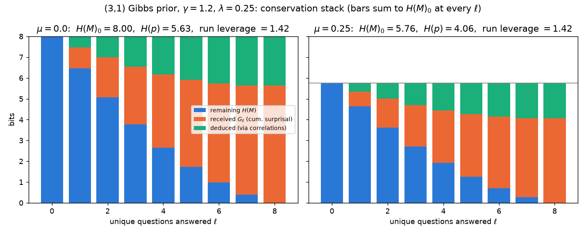
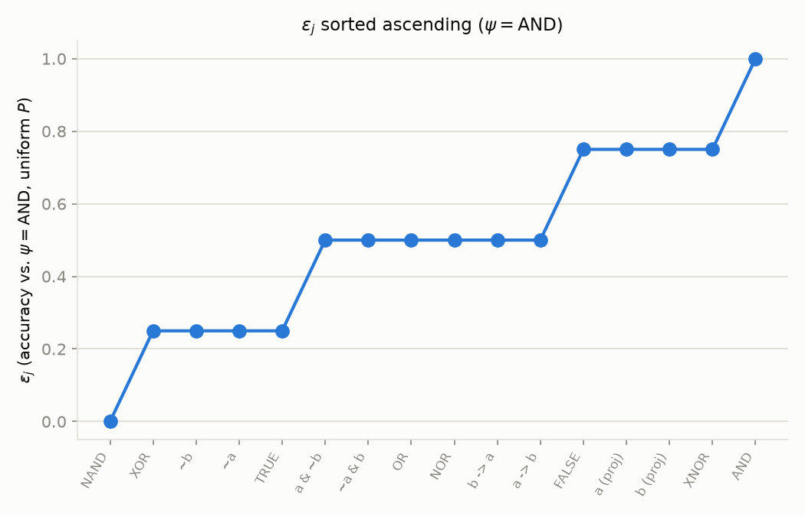
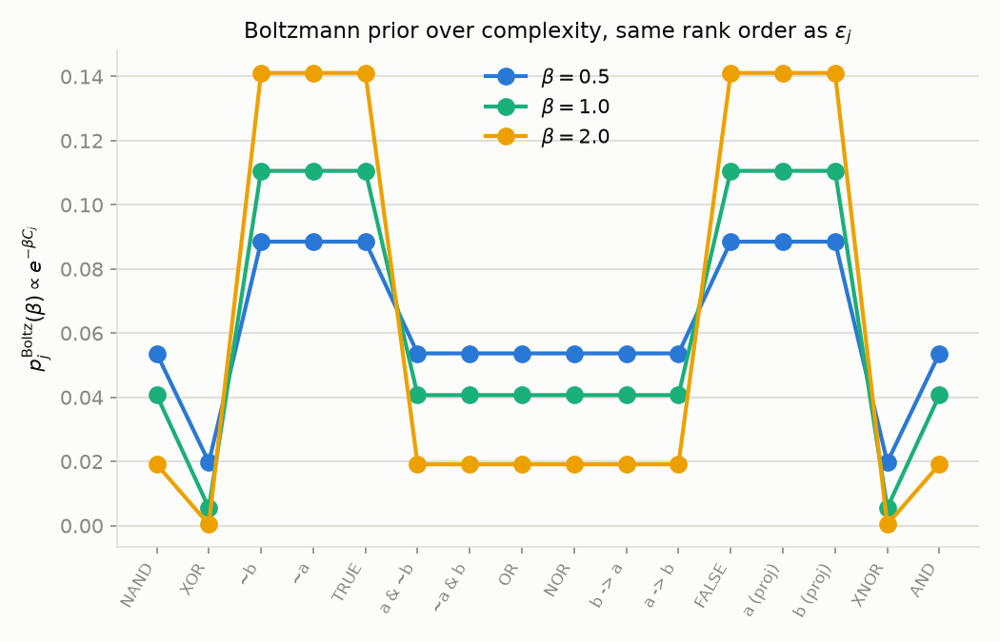

# A Learning Agent over Boolean Maps

## TODO

- [ ] Write an introduction and motivation section explaining the goals of
      this project.
- [x] Relabel answer $a$ (a generic element of $A$) so it no longer
      collides with input bit $a$ (one of the two Boolean variables in the
      running $n=2$ example) — the same symbol currently means two
      different things. *(Done — the inputs are now $b_1, b_0$
      throughout; $a$ always means an answer.)*
- [x] Start j for maps at 0, so the j is actually the representatation in numbers with radix 2^m and there are 2^n digits. Also means we can make questions synonymous with their binary value. i.e. q = 0101 can be written as q = 5. Idem for a. *(Done — $j$ runs $0,\ldots,N-1$; see the numeral-convention note in the Definitions.)*
- [ ] Simplify flow to only use pieces we need: definitions, only stochastic matrix version of B. 
- [ ] Include visualization of binary maps as partial unit cubes, M as cuts of the cube with some plane that doesn't pass through the base unit square.
- [x] Explain why $\sum_k \Delta H(q_k)$, summed over all rounds of a
      realized trace, does not equal the total entropy drop
      $H(p_0)\to 0$ — the gap between an expectation computed fresh each
      round and the actual realized reduction along one particular path.
      *(Done — see the chain-rule discussion closing "General form of the
      entropy reduction": the realized drops do telescope to $H(p)$; it's
      the per-round forecasts that need not match them.)*
- [ ] Formalize the optimal (greedy-max) $\Delta H(q_k)$ as a function of
      round $k$ and the evolving belief $p$ — is there a general
      pattern/bound for how it behaves as rounds proceed?
- [ ] Reframe around predictive power, not internal state: what we
      actually care about is $B$'s predictive quality (the three metrics
      from "Modeling the quality of $B$"), not just how fast its internal
      belief entropy shrinks. We have an example, work out the general case.
- [ ] Map the update rule operators.
- [ ] Frame as: we know the distribution of maps, how to efficiently 
      narrow down.
- [ ] Protocol algorithm for actual implementation: Start with all constant maps, give them a high prior, all others low and uniform. When all constant maps eliminated, re-update prior with all 1-circuit maps (that would survive), etc, constructively.
- [ ] Track how each of the three quality metrics (stochastic $B$,
      best-guess $B$, perplexity) evolves round-by-round as questions are
      asked? Nah...
- [ ] Work a concrete example using the Gibbs prior (circuit-complexity
      based) on the $2\to1$ hypothesis space.
- [ ] Run numerical simulations over the full 65536-row classification
      tables for both flavors ($4\to1$ and $3\to2$).
- [ ] Explore the effect of the Gibbs prior's temperature $\beta$ on the
      learning dynamics.
- [ ] Investigate whether this framework can be turned around to *infer*
      a map's circuit complexity from how learning unfolds, rather than
      assuming complexity is known in advance. I.e. how many questions until
      the bayesian estimator of the map is the true map. 
- [ ] Expanding on that: search for the prior that best allows the box to 
      learn.
- [ ] Can we prove this is optimal? Probably fastest finding vs most
      correct are in tension
- [ ] Think through greedy vs. random question choice — the document
      currently introduces both (Plackett-Luce random order in "The
      question order", greedy max-$\Delta H$ in "Example: splitting the
      open hypotheses") without clearly explaining *why* you'd pick one
      over the other; make that explicit, and survey other greedy
      selection criteria beyond maximizing expected entropy reduction
      (e.g. worst-case reduction, expected rounds-to-completion).
- [ ] Unify writing style throughout the document.
- [ ] Read up and connect to: KL divergence (between $B$'s model and the
      truth, or between two models); the notion of *regret* — the gap
      between the best achievable model and $B$'s actual model; free
      energy; square loss.
- [ ] Explore ising model analogy with couplings between neighboring answers on hypercube?

## Definitions

- **Questions** $Q = \{0,1\}^n$: binary strings of length $n$.
- **Answers** $A = \{0,1\}^m$: binary strings of length $m$.
- **Truth** $\psi: Q \to A$: the one true function nature uses to answer
  questions. $\psi$ is unknown to the learner.
- **Question prevalence** $P(q)$: the real-world frequency of question $q$
  (or our estimate of how often $q$ actually occurs), a distribution over
  $Q$ with $\sum_{q \in Q} P(q) = 1$.
- **Hypothesis space** $\Phi = \{\phi_0, \dots, \phi_{N-1}\}$: the set of *all*
  possible functions $Q \to A$, i.e. every candidate $\psi$ could be. Since
  each of the $2^n$ inputs can map to any of the $2^m$ outputs independently,

$$N = |\Phi| = 2^{m \cdot 2^n}.$$

  This is exactly the row-count of the classification tables, as explained
  in the appendix ($N=65536$ for $(n,m)=(4,1)$ and $(n,m)=(3,2)$).

- **The index is the truth table.** Starting the count at $j=0$, the
  index needn't be an arbitrary label: concatenate a hypothesis's $2^n$
  answers in question order, read each answer as a number in
  $\{0,\ldots,2^m-1\}$, and interpret the resulting string as a
  $2^n$-digit number in radix $2^m$ — *that number is $j$*, running from
  the constant-$0$ map ($j=0$) to the constant-$(2^m{-}1)$ map
  ($j=N-1$). Everything is indexed by weight: question $q$'s answer is
  the digit of weight $(2^m)^q$,

$$
j = \sum_{q=0}^{2^n-1} \phi_j(q)\cdot(2^m)^q,
$$

  and printed tables put question $0$ rightmost (descending question
  order, like the digits of any ordinary numeral), so a printed truth
  table simply *is* $j$. Under the same reading, questions and answers are
  themselves natural numbers, $q\in\{0,\ldots,2^n-1\}$ (input bit $b_i$
  carrying weight $2^i$) and $a\in\{0,\ldots,2^m-1\}$, and we use binary
  strings and their numeric values interchangeably for all three.

- **Consistent-hypothesis sets** $K_a(q) = \{\, j : \phi_j(q) = a \,\}$: the
  indices of hypotheses that would answer $a$ to question $q$. For fixed
  $q$, the sets $K_a(q)$ ($a \in A$) partition $\{0,\dots,N-1\}$, since every
  $\phi_j$ answers exactly one $a$ to a given $q$. In fact, we will show each of the $2^m$ sets is the same size.
- **Per-hypothesis accuracy** $\epsilon_j$: the probability, under $P$, that
  $\phi_j$ would agree with $\psi$ on a random question — i.e. the accuracy
  $\phi_j$ *would have if it were the true map*:

$$\epsilon_j = \sum_{q \in Q} P(q)\, \delta\big(\psi(q), \phi_j(q)\big),$$

  where $\delta(x,y)=1$ if $x=y$ and $0$ otherwise. $\epsilon_j$ is a fixed
  property of $\phi_j$ (relative to $\psi$ and $P$) — it doesn't depend on
  $B$'s belief at all.
- **Learner (box)** $B$: maintains a prior (belief) $p_j = P(\psi = \phi_j)$
  over every hypothesis in $\Phi$, with

$$\sum_{j=0}^{N-1} p_j = 1.$$

  $B$'s prior encodes what it expects the truth to look like *before* seeing
  any question-answer pairs; later, evidence updates $p_j$ (e.g. via Bayes'
  rule), which is the subject of a later section of this project.

## Example: $n=2$, $m=1$

Here $Q=\{00,01,10,11\}$, $A=\{0,1\}$, and $N = 2^{1 \cdot 4} = 16$: every
2-input, 1-output Boolean function of the two input bits $b_1, b_0$,
indexed by weight: $q = b_1 b_0$ read as an ordinary binary number,
$q = 2b_1 + b_0$, so the rightmost bit is $b_0$. Each $\phi_j$ is shown as its truth
table, printed in descending question order $(11,10,01,00)$ so that the
answer to question $q$ occupies the digit of weight $2^q$ — the printed
string is exactly $j$ in binary (e.g. AND, which answers $1$ only to
$q=11$, is $1000 = j{=}8$).

The example prior $p_j$ below is conjured for illustration, not fit to data. 

| $j$ | $\phi_j(11,10,01,00)$ | name | $p_j$ |
|---|---|---|---|
| 0  | 0000 | FALSE (constant 0) | 0.150 |
| 1  | 0001 | $\lnot(b_1 \vee b_0)$ (NOR) | 0.141 |
| 2  | 0010 | $\lnot b_1 \wedge b_0$ | 0.060 |
| 3  | 0011 | $\lnot b_1$ | 0.017 |
| 4  | 0100 | $b_1 \wedge \lnot b_0$ | 0.094 |
| 5  | 0101 | $\lnot b_0$ | 0.015 |
| 6  | 0110 | $b_1 \oplus b_0$ (XOR) | 0.012 |
| 7  | 0111 | $\lnot(b_1 \wedge b_0)$ (NAND) | 0.011 |
| 8  | 1000 | $b_1 \wedge b_0$ (AND) | 0.149 |
| 9  | 1001 | $b_1 = b_0$ (XNOR) | 0.114 |
| 10 | 1010 | $b_0$ (projection) | 0.082 |
| 11 | 1011 | $b_1 \to b_0$ (IF THEN) | 0.016 |
| 12 | 1100 | $b_1$ (projection) | 0.102 |
| 13 | 1101 | $b_0 \to b_1$ (IF THEN) | 0.013 |
| 14 | 1110 | $b_1 \vee b_0$ (OR) | 0.014 |
| 15 | 1111 | TRUE (constant 1) | 0.010 |

$\sum_j p_j = 1.000$; all 16 values distinct. 

## How $B$ learns

For this experiment, $B$ is fed questions one at a time, without
repeats. Asking a question twice teaches $B$ nothing it doesn't already know, so we only care about the order in which the $2^n$ distinct questions are first asked.

### The question order

We could imagine drawing $q \sim P$ repeatedly and discarding repeats, but it's cleaner to describe the resulting process directly: draw $q_1$ with probability $P(q_1)$; having removed it, draw $q_2$ from what remains with probability $P(q_2)$ renormalized by the remaining mass $1-P(q_1)$; and so on until all $2^n$ questions have been drawn. This gives a full ordering
$(q_1,\ldots,q_{2^n})$ of $Q$ with probability

$$
\Pr(q_1,\ldots,q_{2^n}) = \prod_{k=1}^{2^n}\frac{P(q_k)}{\sum_{i=k}^{2^n}P(q_i)},
$$

the **Plackett-Luce distribution**: each factor is $q_k$'s share of the probability mass still remaining once $q_1,\ldots,q_{k-1}$ have already been removed. (Under uniform $P$, every factor's denominator just counts remaining questions, and this reduces to the uniform distribution over all $2^n!$ orderings, as expected.)

### The update rule

At round $k$, $B$ is asked $q_k$, produces a guess (how it decides is the subject of the models below), and then is told the true answer $a = \psi(q_k)$.

Recall $K_a(q)$ from the Definitions above: the hypotheses consistent with answer $a$ to question $q$. Learning $a = \psi(q_k)$ rules out every hypothesis *not* in $K_a(q_k)$ outright:

$$
p_j \leftarrow 0 \quad \text{for } j \notin K_a(q_k).
$$

What about the survivors? Take two surviving hypotheses
$j,l \in K_a(q_k)$: both $\phi_j$ and $\phi_l$ predicted $a$ on $q_k$, so this
round of evidence doesn't distinguish between them at all. If $\phi_j$ was
$r$ times as likely as $\phi_l$ before this round, it must still be $r$
times as likely afterward, nothing has come in to change that ratio. $p_j = p_l \cdot r$ remains. The
only update consistent with preserving every such ratio among survivors is
renormalizing them to sum to 1:

$$
p_j \leftarrow \frac{p_j}{\sum_{i \in K_a(q_k)} p_i} \quad \text{for } j \in K_a(q_k).
$$

(This is Bayes' rule in disguise, not a separate assumption: the
likelihood of observing $a$ given $\phi_j$ is $1$ if $\phi_j(q_k)=a$ and
$0$ otherwise, so Bayes' rule zeroes out the inconsistent hypotheses and
rescales the rest by the same normalizing constant — exactly the
ratio-preserving renormalization above.)

This elimination has a clean, predictable size, because $\Phi$ is the
*full, unconstrained* space of functions $Q\to A$: we're assuming every
input can independently take any of the $2^m$ answers, with a function's
value at one input placing no restriction whatsoever on its values
elsewhere, so $\Phi$ is exactly the Cartesian product $A^{|Q|}$. Having
survived rounds $1,\ldots,k-1$ means exactly: the values at
$q_1,\ldots,q_{k-1}$ are fixed to what was observed, while every other
input, including the fresh $q_k$, is still completely free and
independent. Fixing that still-free value to each of the $2^m$ possible
answers therefore divides whatever's currently open into $2^m$ 
equal groups, of which the true answer keeps exactly one. Since a fresh
question always removes exactly one input from the "still free" pool, the
support of $B$'s distribution shrinks geometrically and predictably every
round:

$$
(2^m)^{2^n+1-k} \;\longrightarrow\; (2^m)^{2^n-k}
$$

at round $k$, depending only on $k$ (and $n,m$). It does not depend on which particular hypotheses survived or which answers were given.

### Collapse entropy

For a not-yet-asked question $q$ and a hypothetical answer $a\in A$,
define the **collapse entropy**

$$
H(a\mid q) := -\sum_{j\in K_a(q)} \frac{p_j}{P(a\mid q)}\,\log_2\frac{p_j}{P(a\mid q)},
\qquad
P(a\mid q) := \sum_{j\in K_a(q)} p_j,
$$

the entropy of $B$'s belief *after* it would collapse via the update rule
above onto $K_a(q)$ — were $a$ the answer actually received. Unlike the
update rule itself, which only fires once $a$ is known, $H(a\mid q)$ can
be computed for every $(q,a)$ pair in advance, from $p$ alone: it's the
"what if" entropy for a hypothetical round that hasn't happened yet.

Averaging over both possible answers (weighted by how likely $B$ currently
thinks each is) gives the expected entropy *after* asking $q$, and hence
the expected entropy *reduction*:

$$
\mathbb{E}_a[H(a\mid q)] = \sum_{a\in A} P(a\mid q)\, H(a\mid q),
\qquad
\Delta H(q) := H(p) - \mathbb{E}_a[H(a\mid q)],
$$

where $H(p) = -\sum_j p_j \log_2 p_j$ is $B$'s current belief entropy.
$\Delta H(q)$ is exactly the quantity the lookahead matrix computed one
question at a time in the next section; asking the question with the
largest $\Delta H(q)$ is the natural greedy criterion for narrowing things
down as fast as possible in expectation.

### Example: splitting the open hypotheses

Take the running $n=2,m=1$ example (16 hypotheses) with $\psi=$ AND, asking
the four questions $00, 01, 10, 11$. Each fresh question $q_k$
splits whatever's currently open into $2^1$ groups $K_a(q_k)$, one per
possible answer, and the true answer $a=\psi(q_k)$ keeps one.

Which first question is the most powerful? Under the prior from the Example section
(all 16 hypotheses, nothing yet asked), each of the four questions divides
the full set into two size-8 groups $K_0(q), K_1(q)$ (equal count, as
established above); here is every cell's membership (names match the
numbering in the Example table):

| $a$ | $q=11$ | $q=10$ | $q=01$ | $q=00$ |
|---|---|---|---|---|
| $0$ | FALSE, b₁∧¬b₀, ¬b₁∧b₀, XOR, NOR, ¬b₀, ¬b₁, NAND | FALSE, AND, ¬b₁∧b₀, b₀(proj), NOR, XNOR, ¬b₁, b₁→b₀ | FALSE, AND, b₁∧¬b₀, b₁(proj), NOR, XNOR, ¬b₀, b₀→b₁ | FALSE, AND, b₁∧¬b₀, b₁(proj), ¬b₁∧b₀, b₀(proj), XOR, OR |
| $1$ | AND, b₁(proj), b₀(proj), OR, XNOR, b₀→b₁, b₁→b₀, TRUE | b₁∧¬b₀, b₁(proj), XOR, OR, ¬b₀, b₀→b₁, NAND, TRUE | ¬b₁∧b₀, b₀(proj), XOR, OR, ¬b₁, b₁→b₀, NAND, TRUE | NOR, XNOR, ¬b₀, b₀→b₁, ¬b₁, b₁→b₀, NAND, TRUE |

Equal *count* doesn't mean equal *probability*, since this prior is far
from uniform. Summing each cell's actual weights and computing its
collapse entropy:

| | $q=11$ | $q=10$ | $q=01$ | $q=00$ |
|---|---|---|---|---|
| $P(0\mid q)$ | 0.500 | 0.729 | 0.778 | 0.663 |
| $H(0\mid q)$ | 2.424 | 2.713 | 2.728 | 2.693 |
||||||
| $P(1\mid q)$ | 0.500 | 0.271 | 0.222 | 0.337 |
| $H(1\mid q)$ | 2.456 | 2.285 | 2.493 | 2.174 |
||||||
| $\mathbb{E}_a[H(a\mid q)]$ | 2.440 | 2.597 | 2.676 | 2.518 |
| $\Delta H(q)$ | 1.000 | 0.843 | 0.764 | 0.922 |

($H(p)=3.440$ bits at the very start.) This time the four questions are
clearly separated, not near-tied: $q=11$ splits the hypothesis set exactly
in half by probability ($0.500/0.500$, despite the prior's heavy skew
elsewhere) and is worth the full $1$ bit — strictly more informative than
every other option — while $q=10,01,00$ trail at $0.843, 0.764, 0.922$
bits respectively, each separated from its neighbors by at least $0.08$
bits.

Following the greedy rule from the previous section — always ask the
unasked question with the largest $\Delta H(q)$ — the first question is
$q_1=11$. The true answer is $\psi(11)=\mathrm{AND}(1,1)=1$, so belief
collapses onto $K_1(11)$ (renormalized) and 8 hypotheses survive:
AND, OR, TRUE, XNOR, $b_1$(proj), $b_1\to b_0$, $b_0$(proj), $b_0\to b_1$. Recomputing
$\Delta H(q)$ for the three remaining questions against this new belief,
then repeating the whole process at each subsequent round:

| round $k$ | remaining questions | $\Delta H(q)$ for each | chosen $q_k$ | true $a$ | survivors after |
|---|---|---|---|---|---|
| 1 | 11, 10, 01, 00 | **1.000**, 0.843, 0.764, 0.922 | 11 | 1 | 8: AND, OR, TRUE, XNOR, b₁(proj), b₁→b₀, b₀(proj), b₀→b₁ |
| 2 | 10, 01, 00 | 0.853, 0.802, **0.889** | 00 | 0 | 4: AND, OR, b₁(proj), b₀(proj) |
| 3 | 10, 01 | **0.919**, 0.851 | 10 | 0 | 2: AND, b₀(proj) |
| 4 | 01 | **0.938** | 01 | 0 | 1: AND |

Every round asks the single best remaining question, and every round's
true answer happens to be $0$ except the first. By round 4 only AND
survives — matching $\psi$, as it must. Interestingly, this greedy order
still takes all four questions to fully pin down the truth (as any order
must here: after round 3, AND and $b_0$(proj) still agree everywhere except
$q=01$, so nothing shorter than the full $2^n=4$ rounds could have
separated them) — maximizing expected information each round narrows
things down as fast as possible on average, but doesn't shrink the
worst-case number of rounds needed.

### Information in a question

How much does asking $q_k$ actually tell $B$ about the identity of the
truth? It's convenient to make explicit something already implicit in
$p_j = P(\psi=\phi_j)$: from $B$'s own subjective point of view, treat the
index of the true map as a random variable $J$ with $P(J=j) = p_j$, and
let $A_{q_k} = \phi_J(q_k)$ be the (as yet unseen) answer it implies. Two
related quantities measure the information $q_k$ carries: surprisal, and expected entropy reduction.

Let us define the surprisal of the answer actually received. Before hearing $a$, $B$'s
own predictive distribution over what the answer will be is
$P(a\mid q_k) = \sum_{j \in K_a(q_k)} p_j$ (this reappears below as $B$'s
induced answer distribution $P_B(a\mid q)$, in the Perplexity subsection).
The specific answer that comes back carries $-\log_2 P(a\mid q_k)$ bits of
Shannon self-information: if $B$ already expected $a$, little is learned
and few hypotheses are eliminated; if $a$ was one $B$ thought unlikely, a
large chunk of belief mass is wiped out in one round.

## Modeling the quality of $B$

There are several equivalent ways to model how good $B$'s current belief
is, and hence how fast $B$ learns: **stochastic $B$**, **best-guess $B$**,
and **perplexity of $B$**. We start with the first — though answering by
random sampling seems like an odd protocol for an agent, it makes the math
particularly simple.

### Stochastic $B$

On question $q$, $B$ samples a hypothesis $\phi_j \sim p$ (draws index $j$
with probability $p_j$) and answers with $\phi_j(q)$.

The expectation that $B$ answers correctly, over both a random question
(drawn from $P$) and $B$'s own random sampling (drawn from $p$), is

$$
\mathbb{E}[\text{correct}] = \sum_{q \in Q} P(q) \sum_{j=0}^{N-1} p_j\, \delta\big(\psi(q), \phi_j(q)\big).
$$

Since this is just a finite double sum, we can reorder it:

$$
\mathbb{E}[\text{correct}] = \sum_{j=0}^{N-1} p_j \underbrace{\sum_{q \in Q} P(q)\, \delta\big(\psi(q), \phi_j(q)\big)}_{\epsilon_j} = \sum_{j=0}^{N-1} p_j\, \epsilon_j.
$$

So under the stochastic protocol, $B$'s expected correctness is simply the
belief-weighted average of each hypothesis's own accuracy $\epsilon_j$ (as
defined above) — a dot product $p \cdot \epsilon$, linear in $B$'s belief.
This linearity is what makes the stochastic model the simplest of the
three to reason about.

### Best-guess $B$

A more operationally sensible protocol: $B$ always answers with its single
most-believed hypothesis, regardless of $q$. Let $j^* = \arg\max_j p_j$.
Then

$$
\mathbb{E}[\text{correct}] = \sum_{q \in Q} P(q)\, \delta\big(\psi(q), \phi_{j^*}(q)\big) = \epsilon_{j^*}.
$$

A single number, not a weighted average — simpler to *state* than the
stochastic result, but harder to *reason about* as $p$ evolves with
evidence: $\arg\max$ is discontinuous in $p$, so a small update can flip
$j^*$ from one hypothesis to an entirely different one, and $\epsilon_{j^*}$
jumps with it. The stochastic model's $p \cdot \epsilon$ is smooth and
differentiable in $p$; best-guess $B$'s performance is not. Best-guess is,
however, exactly what a decision-theoretic agent minimizing 0-1 loss would
do (MAP estimation) — it's the realistic protocol, even if it's the
harder one to analyze.

### Perplexity of $B$

Both previous models score $B$ against the truth $\psi$ — something $B$
itself never has access to. Perplexity instead measures $B$'s own
*uncertainty* about the answer, computable entirely from $B$'s belief $p$
and the hypothesis space $\Phi$, with no reference to $\psi$ at all.

Recall $K_a(q)$ from the Definitions above. This gives $B$'s induced
**answer distribution** at $q$:

$$
P_B(a \mid q) = \sum_{j \in K_a(q)} p_j,
$$

the probability that stochastic-$B$ would answer $a$ to $q$ — a genuine
distribution over $A$, since $\sum_{a} P_B(a\mid q) = \sum_j p_j = 1$.

$B$'s uncertainty at $q$ is the entropy of that distribution, and its
**perplexity at $q$** the exponentiated entropy:

$$
H_B(q) = -\sum_{a \in A} P_B(a\mid q) \log_2 P_B(a\mid q), \qquad
\mathrm{PPL}_B(q) = 2^{H_B(q)} \in [1, 2^m].
$$

$\mathrm{PPL}_B(q)$ reads as the *effective number of equally-likely
answers* $B$ is torn between at $q$: $1$ when $B$'s belief is fully
concentrated on hypotheses that agree on $q$ (no uncertainty), up to
$2^m = |A|$ when $B$'s answer distribution is uniform over every possible
answer. Averaging over questions by prevalence gives an overall figure:

$$
H_B = \sum_{q \in Q} P(q)\, H_B(q), \qquad \mathrm{PPL}_B = 2^{H_B}.
$$

Because none of $K_a(q)$, $P_B(a\mid q)$, $H_B(q)$, or $\mathrm{PPL}_B$
mention $\psi$, $B$ can compute its own perplexity at any time — unlike
$\epsilon_j$ or $\mathbb{E}[\text{correct}]$, which require an outside
evaluator who knows the truth. This makes perplexity a natural
self-assessed confidence signal (e.g. for deciding when to ask another
question rather than commit to an answer).

### $B$ as a stochastic matrix

A fourth way to picture $B$: as a $2^m\times 2^n$ column-stochastic matrix
$M$, one column per question $q\in Q$, one row per answer $a\in A$, with
$M_{a,q}\geq 0$ and $\sum_a M_{a,q}=1$ for every column. Feed in $q$ as a
one-hot vector $e_q\in\mathbb{R}^{2^n}$; $Me_q$ is just column $q$ of $M$,
 the resulting distribution over answers.

A binary map $\phi_j$ is a special case of exactly this shape: the matrix
with a single $1$ in each column, at row $\phi_j(q)$. A *deterministic*
column-stochastic matrix. As a point in the $2^m\times 2^n$ real matrix
space (dimension $2^{n+m}$), $B$'s general $M$ can be any column-stochastic
matrix, while a binary map is confined to one of the $N=2^{m\cdot 2^n}$
all-or-nothing corners.

$N$ vastly exceeds the matrix's own dimension $2^{n+m}$, so an $M$ could result from many combinations of 
mixtures $p_j=P(\psi=\phi_j)$ of them. It's an overcomplete basis for the convex polytope in which $M$ lives. concretely,

$$
M_{a,q} = \sum_{j\in K_a(q)} p_j = P_B(a\mid q),
$$

reusing the induced answer distribution from above. The entries of
$M$ are literally sums of $p_j$ over whichever binary maps have a $1$ in
that slot.

For the running $n=2,m=1$ example, $M$ is just $2\times 4$: two rows
($a=0,1$), four columns ($q=00,01,10,11$), each entry the sum of the
$p_j$ (indices from the Example table) whose $\phi_j$ agrees with that
row on that column:

$$
M =
\begin{pmatrix}
\sum_{j=0}^ 7 p_j &
p_0{+}\ldots{+}p_3{+}p_8{+}\ldots{+}p_{11} &
p_0{+}p_1{+}p_4{+}p_5{+}p_8{+}p_9{+}p_{12}{+}p_{13} &
\sum_{j \text{ EVEN}} p_j \\[4pt]
\sum_{j=8}^{15} p_j &
p_4{+}\ldots{+}p_7{+}p_{12}{+}\ldots{+}p_{15} &
p_2{+}p_3{+}p_6{+}p_7{+}p_{10}{+}p_{11}{+}p_{14}{+}p_{15} &
\sum_{j \text{ ODD}} p_j 
\end{pmatrix}
$$

with columns in the descending question order $(11,10,01,00)$ used
throughout. By the numeral convention from the Definitions this is
automatic, not a coincidence: row $a$, column $q$ collects exactly those
$j$ whose digit of weight $2^q$ — bit $q$ of $j$ — equals $a$; e.g. the
$q=00$ column splits even $j$ from odd $j$. This rule extends verbatim
to larger $m$ (base-$2^m$ digits) and allows for efficient lookup.

Plugging in $B$'s prior from the Example table,

$$
M = \begin{pmatrix} 0.500 & 0.729 & 0.778 & 0.663 \\ 0.500 & 0.271 & 0.222 & 0.337 \end{pmatrix},
$$

exactly the $P_B(a\mid q)$ values already used in the table above (each
column sums to $1$, as it must).

This connects to the models above:

- **Stochastic $B$** is recovered by sampling $a$ from column $q$ of
  $M$ — identical to sampling $\phi_j\sim p$ first and reading off
  $\phi_j(q)$, since both give $a$ with probability $M_{a,q}$.
- The stochastic-matrix picture suggests a *different* best-guess rule:
  for each $q$ independently, answer $\arg\max_a M_{a,q}$ — the
  column-wise mode. Call this **matrix best-guess**. It's the genuine
  Bayes-optimal answer to each question in isolation (it directly
  maximizes $P_B(a\mid q)$ per question, so it's at least as accurate,
  question by question, as the original best-guess). As it produces a definite answer for each a, it is also a binary map. It is interesting to 
  investigate when this map is not the same as the $phi_j$ that maximizes $p_j$.

The update rule has a clean picture here too. Learning $a^*=\psi(q_k)$
doesn't just zero out $K_a(q_k)$'s complement in $p$: it collapses column
$q_k$ of $M$ to a one-hot vector (all mass at row $a^*$, since every
surviving $\phi_j$ answers $a^*$ there by construction), *and*
simultaneously renormalizes every *other* column, since the same
zeroed-out hypotheses were contributing to their entries too. We get a condition that all $p_j$ that contributed to the wrong row in that column vanish. The ones in the right row get blown up. As we recall, every binary map had a value in each column, so this rule touches all $p_j$.

How do we update the stochastic matrix? This applied to every entry of $M$ at once:

$$
M_{a,q} \;\longleftarrow\; \frac{\displaystyle\sum_{j\,\in\, K_a(q)\,\cap\,K_{a^*}(q_k)} p_j}{P(a^*\mid q_k)}
\qquad \text{for every } a\in A,\ q\in Q,
$$

keep only the hypotheses consistent with *both* the column being read off
and the new evidence, then rescale by however much probability mass
survived. Column $q_k$ itself collapses to one-hot as a special case of
this same formula, not a separate rule: setting $q=q_k$, the numerator
is $P(a^*\mid q_k)$ when $a=a^*$ (giving $M_{a^*,q_k}=1$) and $0$
otherwise, since $K_a(q_k)$ and $K_{a^*}(q_k)$ are disjoint for
$a\neq a^*$. Exactly "zero in the wrong row, one in the right row."

It is important to choose an intelligent prior. If every $p_j$
starts uniform, symmetry guarantees every not-yet-asked column stays
exactly uniform ($1/2^m$ in every row) no matter what's been learned
elsewhere. A uniform prior over the full hypothesis space of binary maps
space has, by construction, no correlation between any two questions'
answers, so nothing transfers between columns. A smarter prior breaks
that symmetry: if $p_j$ favors hypotheses whose answers
correlate across questions (e.g. low-complexity functions, which tend to
repeat structure), then resolving one column sharpens others *before
they're ever asked*. So a smart prior allows us to learn on new $q$ we haven't seen, from others we have. This may even be a working definition of intelligence: an instinct for patterns that allows us to learn faster.

### How much does $q$ reduce the entropy of $a$?

Column $q$ of $M$ is a distribution over $A$ in its own right, with its
own entropy: a genuinely different quantity from $H(p)$, the entropy of
$B$'s belief over the $N$ possible $\Phi$. But we could argue that the physical uncertainty we care about is not the internal model of the world in the box, but its predictive power. 

With no information at all, $a$
could be any of the $2^m$ possible answers with equal probability, for a
maximum entropy of $\log_2(2^m)=m$ bits: total ignorance about the
answer. $B$'s actual column-$q$ entropy is exactly $H_B(q)$ from the
Perplexity subsection above, so the *reduction* already achieved by $B$'s
current prior — before any round has actually been played — is

$$
m - H_B(q) \quad \text{bits}.
$$

This is a different quantity from $\Delta H(q)$: $\Delta H(q)$ measures
how much *asking and hearing the answer to* $q$ would shrink $B$'s belief
over all $N$ hypotheses (ranging up to $H(p)$ bits); $m-H_B(q)$ measures
how much $B$'s *current* prior already constrains the *answer itself*
(ranging up to $m$ bits), with no question asked at all — pure structure
already baked into $p$.

For the running $n=2,m=1$ example, $m=1$ bit is the maximum possible:
total ignorance about a single bit. Column by column, using $B$'s prior
from the Example table:

| $q$ | $P_B(0\mid q)$ | $P_B(1\mid q)$ | $H_B(q)$ | reduction $1-H_B(q)$ |
|---|---|---|---|---|
| $11$ | $0.500$ | $0.500$ | $1.000$ | $0.000$ |
| $10$ | $0.729$ | $0.271$ | $0.843$ | $0.157$ |
| $01$ | $0.778$ | $0.222$ | $0.764$ | $0.236$ |
| $00$ | $0.663$ | $0.337$ | $0.922$ | $0.078$ |

$q=01$ is the column $B$ is most confident about *before asking anything*
(only $0.764$ bits of uncertainty in the answer, a $0.236$-bit reduction
from total ignorance), precisely because its split is the most lopsided
($0.778/0.222$). $q=11$, by contrast, is a coin flip: $B$'s prior offers
zero reduction there, a full $1$ bit of irreducible uncertainty about the
answer. 

That's the entropy of $a$ *before* anything is asked. More interesting:
after actually learning the true answer to some $q_k$, how does the
entropy of every *other* column change? Trivially $H_B(q_k)$ itself drops
to $0$ — $B$ just observed $\psi(q_k)$ directly. But the update rule
collapses every other column too, and by how much depends entirely on
whether the prior correlates their answers with $q_k$'s. Row $q_k$ = the
question actually asked and answered (true $\psi=$AND); each column is the
resulting $H_B(q')$ immediately afterward, for every $q'$ including $q_k$
itself. We also copy the prior into the first row, for reference:

| learned $q_k$ | $H_B(11)$ | $H_B(10)$ | $H_B(01)$ | $H_B(00)$ | ‖ | $\langle H_B\rangle_Q$ |
|---|---|---|---|---|---|---|
| - | $1.000$ | $0.843$ | $0.764$ | $0.922$ | ‖ | $0.882$ |
||||||||
| $11$ | $0$ | $0.853$ | $0.802$ | $0.889$ | ‖ | $0.636$ |
| $10$ | $1.000$ | $0$ | $0.795$ | $0.968$ | ‖ | $0.691$ |
| $01$ | $0.999$ | $0.866$ | $0$ | $0.946$ | ‖ | $0.703$ |
| $00$ | $0.998$ | $0.920$ | $0.817$ | $0$ | ‖ | $0.684$ |

Zero down the diagonal, as it must be. Off the diagonal, the picture is
mixed, not uniformly downward: compare each entry against that column's
own baseline in the top row. Learning $q_k=11$ genuinely
helps $q'=00$ ($0.922\to0.889$); but learning $q_k=10$ *raises* $H_B(01)$
above its own baseline ($0.764\to0.795$), and $q_k=00,01$ do the same to
several other columns. This isn't a mistake: the guarantee that
conditioning helps *on average* is a statement about the reduction in
$B$'s belief-space entropy $H(p)$, averaged over $q_k$'s own possible
answers — not a promise that any one *realized* answer must lower every
other column's entropy individually. A correlated prior can just as
easily point the wrong way for a particular realization, the same
phenomenon already seen for surprisal and entropy-drop earlier. 

$\langle H_B\rangle_Q$ is the *uniform* average $\frac{1}{2^n}\sum_{q'\in Q} H_B(q')$
The baseline row's $0.882$ bits is $B$'s
average per-question uncertainty before anything is asked; every learned
$q_k$ pulls that average down. $q_k=11$ gives the largest drop on average
(to $0.636$), which is partly because itself had so much uncertainty, but also due to the interaction with other questions.

In fact, whether one $q$ positively affects another is a *property* of a good prior: a process of elimination should move us through a sequence of good guesses (or best contingent guesses). As this prior was chosen randomly, it is not expected to have that property. Unfortunately, what constitutes a 'good guess' is a property of the true distribution of $\Phi$, and so is by definition empirical.

### General form of the entropy reduction

The examples above suggest a general law, and there is one. The key
observation: under $B$'s belief, the answers $A_q = \phi_J(q)$ (one random
variable per column, $J\sim p$) collectively *are* the hypothesis — a
binary map is nothing but its full table of answers, so the tuple
$(A_q)_{q\in Q}$ determines $J$ and vice versa. Their joint entropy is
therefore exactly $B$'s belief entropy:

$$
H\big(A_{q_1},\ldots,A_{q_{2^n}}\big) = H(p).
$$

Meanwhile the uniform column average $\langle H_B\rangle_Q$ sums the
*marginal* entropies $H_B(q) = H(A_q)$. Marginal entropies always sum to
at least the joint entropy (subadditivity), and the gap is the **total
correlation** of the answers under $p$:

$$
C(p) := \sum_{q\in Q} H_B(q) - H(p) \;\geq\; 0,
$$

zero exactly when the prior makes all answers independent of each other.

This suggests the right formalism: define the **entropy of $M$** as the
*sum* of the column entropies,

$$
H(M) := \sum_{q\in Q} H_B(q),
$$

an **extensive** quantity. Under the uniform prior it equals
$m\cdot 2^n$ — exactly the total information required to fill in the
whole table, doubling with every increment of $n$ (a fully agnostic
learner faces twice the work at $n{+}1$) — and, crucially, it lives on
the *same axis* as received information: surprisal in, reduction of
$H(M)$ out, directly comparable bit for bit. In general $H(M)$
*over*counts what remains to be learned: each column is priced
independently, so shared information is charged once per column that
carries it, and the overcount is exactly the tower,

$$
H(M) = H(p) + C(p)
$$

— the exact identity, valid for any $n$, $m$, and prior $p$. The
per-question *density* $\langle H_B\rangle_Q = H(M)/2^n$ remains useful
when comparing against the $m$-bit-per-question ceiling (and it is what
perplexity exponentiates); in budget form,

$$
m - \langle H_B\rangle_Q = \frac{\big(m\,2^n - H(p)\big) - C(p)}{2^n}.
$$

Read the second form as a budget: $m\,2^n = \log_2 N$ is the maximum
possible belief entropy, so $m\,2^n - H(p)$ is how much $B$'s prior
already "knows" in belief-space — and the average sharpness of its
*predictions* is that knowledge minus the correlation overhead $C(p)$,
spread over the $2^n$ questions. Correlation is knowledge that doesn't
show up in any single marginal. The two extremes make this vivid:

- A **product prior** (answers independent across questions) has
  $C=0$: every bit of belief-space knowledge appears in the marginals,
  and $\langle H_B\rangle_Q = H(p)/2^n$, the minimum possible for a given
  $H(p)$.
- A **maximally redundant prior**, e.g. $p=\tfrac12$ on FALSE and
  $\tfrac12$ on TRUE ($n=2,m=1$): belief entropy is a tiny $H(p)=1$ bit
  (only two live hypotheses!), yet every column is a 50/50 coin flip.
  Here $C = 4-1 = 3$ bits eats the *entire* deficit:
  $m-\langle H_B\rangle_Q = (4-1-3)/4 = 0$. $B$ is almost certain which
  world it's in, and can predict nothing — the two remaining worlds
  disagree everywhere.

For the running example's prior: $H(p)=3.440$, the column entropies sum
to $3.529$, so $C(p)=0.089$ — a weakly correlated prior — and indeed
$\langle H_B\rangle_Q = (3.440+0.089)/4 = 0.882$, matching the baseline
row of the cross table, with reduction $(4 - 3.440 - 0.089)/4 = 0.118$
bits.

**As a function of the round $k$.** The identity is preserved verbatim by
the update rule: after learning the answers to $S_k=\{q_1,\ldots,q_k\}$,
the asked columns contribute $0$ to both sides, and

$$
\langle H_B\rangle_Q^{(k)} = \frac{H(p^{(k)}) + C_k}{2^n},
\qquad
\frac{H(p^{(k)})}{2^n} \;\leq\; \langle H_B\rangle_Q^{(k)} \;\leq\; m\Big(1-\frac{k}{2^n}\Big),
$$

with $C_k$ the total correlation of the *remaining* answers under the
updated belief $p^{(k)}$. Checking this against every row of the cross
table (true $\psi=$AND):

| learned $q_k$ | $H(p^{(1)})$ | $C_1$ | $(H(p^{(1)})+C_1)/4$ | $\langle H_B\rangle_Q$ from cross table |
|---|---|---|---|---|
| $11$ | $2.456$ | $0.087$ | $0.636$ | $0.636$ |
| $10$ | $2.713$ | $0.050$ | $0.691$ | $0.691$ |
| $01$ | $2.728$ | $0.083$ | $0.703$ | $0.703$ |
| $00$ | $2.693$ | $0.042$ | $0.684$ | $0.684$ |

The upper bound $m(1-k/2^n)$ is the **uniform-prior envelope**: with
$p_j$ uniform, every unasked column stays exactly at $m$ bits forever
(as argued in the stochastic-matrix section), so
$\langle H_B\rangle_Q^{(k)} = m(1-k/2^n)$ — a straight line from $m$ down
to $0$, each question earning exactly its own $m/2^n$ share and nothing
more. Any prior sits on or below this line, and *how far below* is
precisely the generalization: for a product prior the unasked columns are
frozen at their prior marginals ($C_k=0$ always); only a correlated prior
($C>0$) can move unasked columns at all.

How much, exactly? In expectation — averaging over the answer $B$ expects
for the asked block, rather than fixing one realization — the entropy of
an unasked column $q'$ after learning $S_k$ is

$$
\mathbb{E}\big[H_B^{(k)}(q')\big] = H(A_{q'}) - I\big(A_{q'};\, A_{S_k}\big):
$$

**expected generalization is mutual information**, the information the
asked block carries about the unasked column under the prior. Since
$I\geq 0$ always, no column's entropy rises *in expectation* — which
finally resolves the cross-table anomaly cleanly. There, learning
$q_k=10$ (realized answer $0$) raised $H_B(01)$ from $0.764$ to $0.795$;
but the other branch (answer $1$, probability $0.271$) would have dropped
it to $0.666$, and the expectation $0.729(0.795)+0.271(0.666)=0.760$ is
below the baseline $0.764$ by exactly $I(A_{01};A_{10})=0.004$ bits. The
prior's correlations point the right way on average and can still point
the wrong way on a given draw.

Finally, the chain rule of entropy ties the whole run together: for any
*fixed* question order, the expected belief-entropy drops per round are
$\mathbb{E}[\Delta H_k] = H(A_{q_k}\mid A_{S_{k-1}})$, and these telescope
exactly:

$$
\sum_{k=1}^{2^n} H\big(A_{q_k}\mid A_{S_{k-1}}\big) = H\big(A_{q_1},\ldots,A_{q_{2^n}}\big) = H(p).
$$

(Numerically confirmed for the running example: the four conditional
answer entropies along the order $00,01,10,11$ sum to $3.440 = H(p)$.)
Every question order spends the same total budget $H(p)$ *in
expectation* — greedy max-$\Delta H$ selection can only front-load the
spending, not increase it. On a single realized trace the picture
differs in a specific way: the *realized* drops
$H(p^{(k-1)})-H(p^{(k)})$ also telescope perfectly (from $H(p)$ down to
$0$), but each round's *forecast* $\Delta H(q_k)$ — an expectation
computed fresh from the belief of that moment — need not equal the drop
that then actually occurs, which is why the running example's realized
drops kept undershooting their forecasts (AND, a high-prior hypothesis,
kept surviving; surprises never materialized).

### Closed forms from the index representation

Can the calculation be carried all the way through to elementary
functions? For a general prior, no — but the index representation from
the stochastic-matrix section shows exactly *which* priors allow it, and
gives a sharp limit law for generic ones.

Recall the indexing rule ($m=1$): writing $j$ in binary, bit $q$ of
$j$ is $\phi_j(q)$ — the hypothesis index *is* the truth table. Column
$q$ of $M$ is then a subset sum over half the indices, selected by one
bit:

$$
M_{1,q} = \sum_{j\,:\,\mathrm{bit}_q(j)=1} p_j,
\qquad
\langle H_B\rangle_Q = \frac{1}{2^n}\sum_{q} h\big(M_{1,q}\big),
$$

where $h(x)=-x\log_2 x-(1-x)\log_2(1-x)$ is the binary entropy function.
The $2^n$ bit-mask subset sums are the only aggregates of $p$ that
matter. Two cases collapse to elementary functions.

**Solvable case 1: energy additive over answer bits.** Take a Gibbs prior
whose energy is the *popcount* of the truth table,
$E(j)=\mathrm{popcount}(j)$ — the exact version of the "$0$-over-$1$
bias" the running example gestures at. Because the energy is a sum over
bits, the partition function factorizes over the $2^n$ bit positions:

$$
Z=\sum_{j} e^{-\beta\,\mathrm{popcount}(j)}
 =\prod_{q}\big(1+e^{-\beta}\big) = \big(1+e^{-\beta}\big)^{2^n},
$$

and with it the whole prior: each answer bit is independently $1$ with
probability $\sigma(-\beta)=1/(1+e^{\beta})$, the logistic function.
Everything is then elementary, exactly, for every $n$:

$$
M_{1,q}=\sigma(-\beta)\ \ \forall q,\qquad
\langle H_B\rangle_Q = h\big(\sigma(\beta)\big),\qquad
H(p)=2^n\,h\big(\sigma(\beta)\big),\qquad
C(p)=0,
$$

and as a function of the round, $\langle H_B\rangle_Q^{(k)} =
(1-k/2^n)\,h(\sigma(\beta))$ — asked columns zero out, unasked columns
never move. (Verified to machine precision in `entropy_identities.py`;
the same factorization gives $m\,h(\sigma(\beta))$ per column for $m>1$,
and survives replacing popcount by Hamming distance to any fixed
reference map, since that's just a per-column relabeling $0\leftrightarrow 1$.)
The moral cuts both ways: this whole family of priors is exactly
solvable *because* $C=0$ — and $C=0$ means zero generalization. An
additive-over-bits energy is a "non-interacting" prior. Genuine circuit
complexity is not of this form — an AIG's size couples the answer bits
to each other — and that coupling is precisely what lets a
complexity-based prior transfer information to unasked columns.
(Energies that couple *pairs* of answer bits turn the prior into an
Ising model on the question set, with column marginals as magnetizations
and the mutual-information transfer as spin-spin correlations — beyond
elementary functions, but squarely in statistical-mechanics territory.)

**Solvable case 2: a generic prior, in the limit.** Draw $p$ uniformly at
random from the $N$-simplex (Dirichlet with all parameters $1$). Each
column probability is a sum of exactly $N/2$ coordinates, which is
$\mathrm{Beta}(N/2,\,N/2)$-distributed: sharply concentrated at
$\tfrac12$ with variance $\tfrac{1}{4(N+1)}$. Expanding
$h(\tfrac12+\varepsilon) = 1 - \tfrac{2}{\ln 2}\varepsilon^2 +
O(\varepsilon^4)$ and taking expectations,

$$
\mathbb{E}\big[\,m-\langle H_B\rangle_Q\,\big]
= \frac{1}{2\ln 2\,(N+1)} + O(N^{-2}),
\qquad N = 2^{2^n},
$$

doubly exponentially small in $n$ (numerics at $n=3$: measured
$0.002812$ vs. predicted $0.002807$). And the $k$-dependence rides along
for free: conditioning a flat Dirichlet on the survivors of $k$ answers
leaves a flat Dirichlet on the $N_k = 2^{2^n-k}$ survivors, so the same
formula applies with $N\to N_k$ — the reduction stays negligible until
$2^n - k$ is $O(1)$. A generic prior predicts essentially nothing until
nearly every question has already been asked: the mass of the simplex
sits at "maximally uncertain in every column," and only the collapse of
$N_k$ to a handful of survivors pulls the columns away from the fair
coin. Structure (case 1's bias, or a complexity energy) is not a nicety
— without it, prediction before the final rounds is doubly exponentially
close to worthless.

### General $m$: base-$2^m$ digits

Everything above fixed $m=1$ so the index could be read off in plain
binary. The natural generalization: write $j$ in base $2^m$ instead of
base $2$ — one *digit* per question, each digit ranging over all of
$A=\{0,\ldots,2^m-1\}$ rather than just a bit:

$$
j = \sum_{q=0}^{2^n-1} \phi_j(q)\cdot(2^m)^q,
\qquad
\phi_j(q) = \mathrm{digit}_q^{(2^m)}(j),
$$

directly generalizing "bit $q$ of $j$" to "base-$2^m$ digit $q$ of
$j$." Column $q$ of $M$ is the full distribution of that digit's $2^m$
possible values, and $H_B(q)=H(M_{\cdot,q})$ is now bounded by $m$, not
$1$.

Nothing in the derivation of the general identity used $m=1$: the
answers still jointly determine the hypothesis, so
$H(A_{q_1},\ldots)=H(p)$ still holds, subadditivity still gives
$C(p)\geq0$, and

$$
\langle H_B\rangle_Q^{(k)} = \frac{H(p^{(k)})+C_k}{2^n},
\qquad
0\;\leq\;\langle H_B\rangle_Q^{(k)}\;\leq\; m\Big(1-\frac{k}{2^n}\Big),
$$

is exact for every $m$, unchanged. What *does* change with $m$ is the two
solvable cases.

**Case 1, revisited.** An energy additive over positions,
$E(j)=\sum_q c(\phi_j(q))$ for any cost $c:A\to\mathbb R$, still
factorizes the partition function over the $2^n$ questions — the
argument never used $|A|=2$ — giving $2^n$ independent, identically
distributed digits drawn from a single-symbol Boltzmann distribution
$\pi_a\propto e^{-\beta c(a)}$, so $\langle H_B\rangle_Q^{(k)} =
(1-k/2^n)H(\pi_\beta)$ and $C_k=0$ again. Now *which* $c$ you pick starts
to matter, in a way it couldn't when there was only one bit to cost:

- $c(a)=\mathrm{popcount}_2(a)$ — penalize each of the $m$ *bits within
  the answer* independently — makes $\pi_\beta$ a product of $m$
  independent Bernoulli$(\sigma(-\beta))$ bits, so
  $H(\pi_\beta)=m\,h(\sigma(\beta))$: exactly $m$ non-interacting copies
  of the $m=1$ result. The answer's own bits carry no information about
  each other.
- $c(a)=a$ — cost the answer's integer value directly, which *does*
  couple its $m$ bits (symbol $3$ costs more than symbol $2$, even
  though both have different bit-popcounts) — makes $\pi_\beta$ a
  truncated geometric distribution on $\{0,\ldots,2^m-1\}$ with ratio
  $r=e^{-\beta}$:

$$
\pi_a = \frac{r^a}{z(\beta)},\qquad
z(\beta)=\sum_{a=0}^{2^m-1} r^a = \frac{1-r^{2^m}}{1-r},
$$

  still an elementary (finite geometric) closed form, with entropy

$$
H(\pi_\beta) = \log_2 z(\beta) + \frac{\beta}{\ln 2}\left[\frac{r}{1-r} -
\frac{2^m r^{2^m}}{1-r^{2^m}}\right]
$$

  (the bracket is the mean of the truncated geometric — verified to $6$
  decimal places against direct computation of $H(\pi_\beta)$ for
  $n=2,m=2$). The two choices of $c$ agree at $m=1$ (both give
  $h(\sigma(\beta))$) and diverge for $m\geq2$: either way $H_B(q)$ is
  the marginal uncertainty of a whole answer, but only the second energy
  makes the *bits within one answer* informative about each other — a
  distinction that simply doesn't exist when $m=1$.

**Case 2, revisited.** The generic-prior calculation goes through with
one change: each column is now a sum over $2^m$ (not $2$) equal-size
blocks of a flat Dirichlet($1$) prior on $N=(2^m)^{2^n}$ hypotheses, so
by the aggregation property of the Dirichlet distribution, column $q$'s
answer distribution is *exactly* $\mathrm{Dirichlet}(N/2^m,\ldots,N/2^m)$
with $2^m$ parts. The same second-order expansion around the uniform
point — now uniform over $2^m$ symbols instead of $2$ — gives

$$
\mathbb{E}\big[m-\langle H_B\rangle_Q\big] = \frac{2^m-1}{2\ln2\,(N+1)}
+ O(N^{-2}), \qquad N=2^{m\cdot2^n},
$$

the $m=1$ formula times $(2^m-1)$: a generic prior's ignorance about
*which of the $2^m$ answers* is right scales with how many wrong answers
there are to be ignorant about, while the doubly-exponential smallness in
$N$ — and hence in both $n$ *and* $m$ — is unchanged. This survives
conditioning on $k$ answered questions with $N\to N_k=2^{m(2^n-k)}$
exactly as before (verified numerically, including the more demanding
$n=3,m=2,k=3$ case: measured $0.00207$ vs. predicted $0.00211$).

### Correlated but still solvable: mixtures of product priors

The two solvable cases above bought their closed forms by giving up
correlation: $C=0$ exactly (case 1) or doubly exponentially close to it
(case 2), so nothing learned at one question ever moved another column.
This section constructs a family of priors that is genuinely correlated —
$C(p)$ *extensive* in the number of questions — while keeping the update
rule, the evolution of $M$, and the expected entropy drop of every
question elementary at every round. Throughout, take $P(q)$ uniform, as
in the worked examples: the question order is then a uniform shuffle and
plays no role in any of the formulas.

**First, a lemma that holds for every prior.** For a not-yet-asked $q$,

$$
\Delta H(q) \;=\; H_B(q):
$$

the expected drop in *belief*-space entropy from asking $q$ is exactly
the answer entropy of column $q$ of $M$. Proof in one line: with
$J\sim p$ the hypothesis index and $A_q=\phi_J(q)$,

$$
\Delta H(q) = H(J) - H(J\mid A_q) = I(J; A_q) = H(A_q) - \underbrace{H(A_q\mid J)}_{0} = H(A_q),
$$

since the answer is a deterministic function of the hypothesis. (Check
against the running example: the $\Delta H(q)$ row $0.922, 0.764, 0.843,
1.000$ and the $H_B(q)$ column of the reduction table are the same four
numbers — not a coincidence.) This is the pointwise version of the
chain-rule statement $\mathbb{E}[\Delta H_k]=H(A_{q_k}\mid A_{S_{k-1}})$:
at round $k$ the belief has already conditioned on the realized history,
so the greedy criterion needs nothing beyond the current $M$ — *ask the
question whose column of $M$ is currently most uncertain*. Two
consequences frame what follows. First, predicting each question's
expected entropy drop is exactly as hard as computing the columns of
$M$. Second, $M$ alone can't predict *cross*-column movement — the
expected generalization $I(A_{q'};A_{q_k})$ needs pairwise joints, which
is precisely the structure a tractable correlated prior must keep
elementary.

**The family.** Introduce a latent *theme* $T\in\{1,\ldots,L\}$ with
weights $w_t$, and let the answers be independent across questions
*given the theme*:

$$
p_j \;=\; \sum_{t=1}^{L} w_t \prod_{q\in Q} \pi_t\big(\phi_j(q)\,\big|\,q\big),
$$

a mixture of $L$ product priors ($L=1$ recovers solvable case 1, with
$C=0$). Conditional independence given $T$ is the engine of everything
below: the questions interact, but only through the single shared
variable $T$ — a "star coupling," in contrast to the pairwise Ising
couplings mentioned above, which put interactions on edges between
questions and leave elementary territory. Four properties follow.

1. **Columns of $M$ are mixtures of the component columns:**
   $M_{a,q}=\sum_t w_t\,\pi_t(a\mid q)$. So $M$ lives in the convex hull
   of the $L$ component matrices, and the entire belief state, as far as
   prediction is concerned, is the point $w\in\Delta^{L-1}$.

2. **The family is closed under the update rule.** Observing
   $a^*=\psi(q_k)$ multiplies each component's likelihood in and
   renormalizes:

$$
w_t \;\longleftarrow\; \frac{w_t\, \pi_t(a^*\mid q_k)}{M_{a^*,q_k}},
$$

   with column $q_k$ pinned to $a^*$ in every component and all other
   component columns untouched. The posterior is again a mixture of
   products, so this holds at every round: the full $2^m\times 2^n$
   matrix update from the stochastic-matrix section collapses to an
   $L$-dimensional multiplicative reweighting. (In expectation over the
   answer, $\mathbb{E}[M'] = M$ — the update is a martingale, as for any
   prior; what moves predictably is not the matrix but its entropy.)

3. **Every expected entropy drop is elementary.** By the lemma,
   $\Delta H_k(q)$ is the entropy of the current mixture column
   $\sum_t w_t^{(k)}\pi_t(\cdot\mid q)$. And the pairwise joints are just
   $P(A_{q_k}{=}a, A_{q'}{=}a')=\sum_t w_t\,\pi_t(a\mid q_k)\,\pi_t(a'\mid q')$,
   so the expected generalization
   $\mathbb{E}_{a}[H_B'(q')] = H_B(q') - I(A_{q'};A_{q_k})$ is a finite
   sum of elementary terms — the mutual-information transfer that was
   "beyond elementary functions" for Ising couplings is closed-form here.

4. **Belief entropy and total correlation.** Conditioning on $T$ and
   using the chain rule,

$$
H(p) = H(w) + \sum_t w_t \sum_q H\big(\pi_t(\cdot\mid q)\big) - H(T\mid A),
\qquad
C(p) = \sum_q I(A_q;T) - I(A;T),
$$

   where $H(T\mid A)$ — the *identifiability leakage*, how uncertain the
   theme would remain even knowing the full answer table — is the one
   non-elementary term, and it is at most $\log_2 L$ and exponentially
   small once the components are distinguishable. The correlation budget
   reads directly off the second identity: each of the $2^n$ questions
   contributes its own $I(A_q;T)$ to $C(p)$, while the subtracted
   $I(A;T)\leq H(w)\leq \log_2 L$ is capped. Correlation is extensive;
   the price of predicting it is an $L$-dimensional state.

**Flagship instance: noisy templates.** Pick $L$ reference maps
$\psi_t$ (the natural choice: the low-complexity tier of the hypothesis
space) and a symbol-noise level $\varepsilon$:

$$
\pi_t(a\mid q) =
\begin{cases}
1-\varepsilon & a = \psi_t(q),\\[2pt]
\varepsilon/(2^m-1) & \text{otherwise.}
\end{cases}
$$

"The truth is one of these $L$ patterns, corrupted independently per
question." Each component alone is exactly solvable case 1 with the
Hamming-distance energy $d(\phi,\psi_t)$ at
$\beta=\ln\big[(1-\varepsilon)(2^m-1)/\varepsilon\big]$; the mixture is a
multi-well version — $L$ Hamming balls instead of one — and the wells
are what correlate the questions. Everything specializes pleasantly:

- **Columns are votes plus a noise floor.** With
  $v_q(a)=\sum_{t:\,\psi_t(q)=a} w_t$ the weighted vote share of answer
  $a$ among templates,

$$
M_{a,q} = \frac{\varepsilon}{2^m-1} + \Big(1-\varepsilon-\frac{\varepsilon}{2^m-1}\Big)\, v_q(a),
$$

  so $\Delta H(q)$ depends only on the vote profile $v_q$. Questions
  where the (currently plausible) templates all agree sit at the noise
  floor $h_\varepsilon := H\big(1-\varepsilon,
  \tfrac{\varepsilon}{2^m-1},\ldots\big)$; the greedy rule becomes *ask
  where the surviving templates disagree most* — a tournament among
  patterns, not per-question memorization.

- **Updates are score-keeping.** An answer matching template $t$ but not
  $s$ shifts the log-odds $\ln(w_t/w_s)$ by the constant
  $\ln\big[(1-\varepsilon)(2^m-1)/\varepsilon\big]$; an answer matching
  *no* template multiplies every $w_t$ by the same
  $\varepsilon/(2^m-1)$ and leaves $w$ exactly unchanged — corrupted
  entries are absorbed by the noise and teach nothing about the theme.

- **Generalization saturates early.** Once $w$ has collapsed onto one
  template, every unasked column sits at exactly $h_\varepsilon$: the
  box predicts every remaining answer with confidence $1-\varepsilon$
  before asking, and each remaining round is worth $h_\varepsilon$
  bits — the residual cost of pinning down the noise realizations, not
  the pattern.

**Numerical verification** (`mixture_prior.py`): $n=3$, $m=2$
($N=4^8=65536$ hypotheses), $L=3$ templates — copy the low two input
bits; constant $0$; both output bits equal to $b_2$ — with
$w=(0.5,0.3,0.2)$ and $\varepsilon=0.15$ ($h_\varepsilon=0.8476$). All
mixture-side predictions were checked against brute force over all
$65536$ hypotheses, to machine precision: the columns of $M$, the lemma
$\Delta H(q)=H_B(q)$ (on this prior and on the running $n=2,m=1$
example's), all $56$ pairwise joints and the expected-generalization
formula, the entropy decomposition
$H(p)=8.2368=1.4855+8\times0.8476-0.0294$ (leakage $H(T\mid A)=0.029$
bits — tiny, the templates are well separated), and
$C(p)=3.128$ bits of genuine total correlation. Round 1's forecasts read
straight off the vote profiles: the full-agreement question $q=000$ sits
at the noise floor $0.8476$; the $0.5/0.5$-split questions
($001,010,011$) at $1.4690$; the three-way splits ($101,110$) top the
list at $1.7252$. Running the full greedy trace against a true map equal
to template 1 corrupted at $q=110$ ($2\to1$):

| $k$ | asked $q_k$ | forecast $\Delta H$ | realized drop | $w$ after | $\langle H_B\rangle_Q$ | envelope $m(1-k/2^n)$ |
|---|---|---|---|---|---|---|
| 1 | $101$ | $1.725$ | $1.954$ | $(0.944, 0.033, 0.022)$ | $0.843$ | $1.750$ |
| 2 | $110$ | $1.015$ | $0.862$ | $(0.944, 0.033, 0.022)$ | $0.716$ | $1.500$ |
| 3 | $001$ | $1.005$ | $1.154$ | $(0.997, 0.002, 0.001)$ | $0.534$ | $1.250$ |
| 4 | $010$ | $0.859$ | $0.875$ | $(1.000, 0.000, 0.000)$ | $0.424$ | $1.000$ |
| 5 | $011$ | $0.848$ | $0.849$ | $(1.000, 0.000, 0.000)$ | $0.318$ | $0.750$ |
| 6 | $111$ | $0.848$ | $0.848$ | $(1.000, 0.000, 0.000)$ | $0.212$ | $0.500$ |
| 7 | $100$ | $0.848$ | $0.848$ | $(1.000, 0.000, 0.000)$ | $0.106$ | $0.250$ |
| 8 | $000$ | $0.848$ | $0.848$ | $(1.000, 0.000, 0.000)$ | $0.000$ | $0.000$ |

Every phenomenon promised above is visible. One three-way-split question
(round 1) nearly settles the tournament. Round 2 hits the corrupted
entry: the answer matches no template, $w$ does not move at all, and the
realized drop undershoots the forecast — the noise absorbed it. By round
4 the theme is settled and every remaining forecast is exactly
$h_\varepsilon=0.8476$, matched by the realized drops (no surprises left
but noise). And $\langle H_B\rangle_Q$ runs far below the uniform-prior
envelope from the very first round ($0.843$ vs $1.750$) — the
generalization to unasked columns that $C>0$ was supposed to buy, now
with every step of it predicted in closed form from a 3-dimensional
state.

At $\varepsilon\to 0$ the model degenerates gracefully: the prior
becomes $L$ point masses, the noise floor vanishes, and learning is pure
tournament — each question worth $H(v_q)$, zero once one template
survives. At the other extreme, letting $L\to N$ with every hypothesis
its own template recovers an arbitrary prior — and loses tractability
with it. The family is useful exactly in between: a small library of
patterns plus noise tolerance, which is arguably what the earlier
"instinct for patterns" definition of intelligence looks like when made
concrete — and a tractable surrogate for the Gibbs-over-circuit-complexity
prior, whose low-complexity tier supplies the natural template library.

### The update rule as a convolution: the correlator basis

What kind of operator *is* the update rule? On unnormalized beliefs it is
multiplication by the diagonal 0/1 likelihood matrix
$D_{q,a}=\mathrm{diag}\big(\delta(\phi_j(q),a)\big)$ — a coordinate
projection followed by rescaling, and different rounds commute (diagonal
matrices), which is why only the *set* of question–answer pairs matters,
never their order. But there is a change of basis in which the update
becomes a *convolution*, and in that basis one can watch, shell by shell,
exactly where the prior stores its knowledge and how each answer moves it
around. This section develops that picture for $m=1$ (one bit per
answer); the general case is sketched at the end.

**Step 0: answers as spins.** A hypothesis is nothing but its truth
table, a point $x\in\{0,1\}^{2^n}$, so $B$'s belief is a distribution on
the $2^n$-dimensional hypercube and the random answers $A_q$ are its
coordinates. Re-encode each answer as a spin,

$$
s_q := (-1)^{A_q} \in \{+1,-1\},
$$

so answer $0\mapsto+1$ and $1\mapsto-1$. A relabeling — but it buys the
one algebraic fact everything below turns on: $s_q^2 = 1$.

**Step 1: the correlator ledger.** For each *subset* $S\subseteq Q$,
define

$$
\hat p(S) := \mathbb{E}_p\Big[\prod_{q\in S} s_q\Big].
$$

Read these shell by shell; each shell stores a different *kind* of
knowledge. For the running example prior:

- **Shell 0** ($S=\emptyset$): the empty product is $1$, so
  $\hat p(\emptyset)=1$ always — normalization, riding along as a
  correlator.
- **Shell 1** (singletons): $\hat p(\{q\}) = P(A_q{=}0)-P(A_q{=}1)$, the
  *bias* of column $q$. This shell **is the stochastic matrix $M$** in
  different clothes, $M_{0,q}=\tfrac12(1+\hat p(\{q\}))$. For the example
  prior: $\langle s_{00}\rangle=+0.326$, $\langle s_{01}\rangle=+0.556$,
  $\langle s_{10}\rangle=+0.458$, $\langle s_{11}\rangle=0.000$ — the
  familiar columns $(0.663, 0.778, 0.729, 0.500)$.
- **Shell 2** (pairs): $\hat p(\{q,q'\}) = P(A_q{=}A_{q'}) -
  P(A_q{\neq}A_{q'})$, the *agreement bias* of two questions — knowledge
  $M$ cannot see: two priors can share every column and differ here. For
  the example prior, raw and *connected* (covariance,
  $\hat p(\{q,q'\})-\hat p(\{q\})\hat p(\{q'\})$) values:

| pair | $\hat p(\{q,q'\})$ | connected |
|---|---|---|
| $00,01$ | $+0.098$ | $-0.083$ |
| $00,10$ | $-0.020$ | $-0.169$ |
| $00,11$ | $-0.062$ | $-0.062$ |
| $01,10$ | $+0.202$ | $-0.053$ |
| $01,11$ | $+0.044$ | $+0.044$ |
| $10,11$ | $+0.014$ | $+0.014$ |

- **Shells 3, 4, …**: parity biases of triples, quadruples, … of
  questions — subtler and subtler structural knowledge (for the example
  prior the full-table parity bias is a tiny $+0.004$).

Two facts make this a genuine coordinate system rather than a grab-bag
of statistics. **Completeness**: there are $2^{2^n}$ subsets and
$2^{2^n}$ probabilities, and the map between them is the invertible
Walsh–Hadamard transform,
$p(x) = 2^{-2^n}\sum_S \hat p(S)\prod_{q\in S}(-1)^{x_q}$ — knowing
every correlator *is* knowing the belief. **Independence has a
signature**: a product prior ($C=0$) factorizes every correlator,
$\hat p(S)=\prod_{q\in S}\hat p(\{q\})$, so its upper shells contain
nothing shell 1 didn't already say; correlated knowledge is precisely
*non-factorizing* correlators, which is why the connected values above
are the honest measure of what shell 2 knows beyond $M$.

**Step 2: the update in position space.** Learning $\psi(q_k)=a$ does
three things to $p$ as a function on the hypercube: *filter* (multiply
pointwise by the mask $\mathbb{1}[x_{q_k}{=}a]$), *discard* (the masked
half-cube is now zero), *renormalize* (divide by the surviving mass
$P(a\mid q_k)$).

**Step 3: the same three steps in the correlator basis.** The mask is
itself a two-term correlator object: with $\sigma:=(-1)^a$ the observed
answer as a spin,

$$
\mathbb{1}[x_{q_k}=a] = \frac{1+\sigma\,s_{q_k}}{2}
$$

(if $x_{q_k}=a$ then $s_{q_k}=\sigma$ and this is $1$; otherwise $0$).
The brutal-looking filter is "one plus one spin" — the simplest possible
correlation structure, and this sparsity is the whole reason the update
is tractable here. Now multiply it into a monomial $\prod_{S}s_q$ and
take expectations: if $q_k\notin S$ the monomial *gains* the factor
$s_{q_k}$; if $q_k\in S$ it already has one and $s_{q_k}^2=1$ makes it
*drop out*. Either way the result is the correlator of the **symmetric
difference** $S\triangle\{q_k\}$ — multiplication in position space has
become an index shift in correlator space, i.e. a convolution (over the
group $\mathbb{Z}_2^{2^n}$) whose kernel has only two nonzero entries.
Renormalization is division by the new shell 0, which is the
$S=\emptyset$ case: $P(a\mid q_k)=\tfrac12(1+\sigma\hat p(\{q_k\}))$ —
shell 1 is $M$, as promised. Altogether:

$$
\hat p'(S) \;=\; \frac{\hat p(S) + \sigma\,\hat p\big(S\triangle\{q_k\}\big)}{1+\sigma\,\hat p(\{q_k\})}.
$$

Every correlator is averaged with its **partner** — the correlator
differing from it only by membership of the asked question — signed by
the answer, then rescaled by the answer's probability. (Verified in
`walsh_update.py` for the example prior, all $(q_k,a,S)$ triples, max
error $3\times10^{-16}$.)

**Step 4: read the formula shell by shell.**

- $S=\emptyset$: partner $\{q_k\}$, giving
  $(1+\sigma\hat p(\{q_k\}))/(1+\sigma\hat p(\{q_k\}))=1$.
  Normalization preserved.
- $S=\{q_k\}$: partner $\emptyset$, giving
  $(\hat p(\{q_k\})+\sigma)/(1+\sigma\hat p(\{q_k\}))=\sigma$. The bias
  saturates to certainty — the one-hot collapse of column $q_k$,
  *derived* rather than decreed.
- $S=\{q'\}$, an unasked column — **generalization**: partner is the
  pair $\{q',q_k\}$, and a line of algebra puts the shift in terms of
  the connected correlator:

$$
\hat p'(\{q'\}) - \hat p(\{q'\})
= \frac{\sigma\,\mathrm{Cov}(s_{q'},s_{q_k})}{2\,P(a\mid q_k)}.
$$

  Knowledge stored one shell up *descends* into the marginal, in
  proportion to the covariance. A product prior has zero covariance
  everywhere, so unasked columns are frozen — the "$C=0$ means no
  transfer" statement from the stochastic-matrix section, now as a
  one-line algebraic consequence: there is nothing upstairs to bring
  down.
- Higher shells: the same cascade. Each update marries shell-$k$
  correlators containing $q_k$ to shell-$(k{-}1)$ correlators not
  containing it: whatever structure was stored *jointly with $q_k$*
  moves one level down toward the observable shell 1, i.e. toward $M$.

**The cross-table anomaly, solved by a covariance sign.** The reduction
cross table flagged that learning $q_k=10$ (answer $0$, so $\sigma=+1$)
*raises* $H_B(01)$ from $0.764$ to $0.795$. In correlator language: the
raw agreement $\langle s_{01}s_{10}\rangle=+0.202$ is *less* than the
product of biases $0.556\times0.458=0.255$, so the connected correlator
is $-0.053<0$ — it points the "wrong" way. The shift is
$(+1)(-0.053)/(2\times0.729)=-0.036$, dropping the bias to $+0.520$:
column $01$ moves *toward* the fair coin and its entropy rises to
$0.795$. The other branch ($a=1$, $\sigma=-1$) flips the sign: bias
$+0.653$, entropy $0.665$ — both branches matching the cross table.
The mutual-information resolution given earlier
($I(A_{01};A_{10})=0.004$ bits, so conditioning helps on average) is the
entropy-weighted version of this same covariance, averaged over
$\sigma$.

**General $m$.** For $m>1$, view the
truth table as $m\cdot 2^n$ bits and run the same construction over
$\mathbb{Z}_2^{m2^n}$: the mask at $(q_k,a^*)$ is a function of the $m$
bits at position $q_k$, so its transform has at most $2^m$ terms and the
update couples $\hat p(S)$ to $\hat p(S\triangle T)$ for
$T\subseteq$ the bits of $q_k$ — still a sparse convolution. The next
section works this out concretely, with numbers.

**The summary picture.** The belief is a ledger of correlators sorted by
order. Shell 1 is $M$ — the directly predictive knowledge; everything
above it is latent structural knowledge invisible to $M$, and the total
correlation $C(p)$ measures how much is stored up there. Seen from this
basis the update rule does exactly one thing: it pairs every correlator
with its $q_k$-toggled partner and renormalizes — certainty saturates at
the asked question, and one level of latent structure involving $q_k$ is
converted into predictive bias everywhere else. Learning is the
controlled demolition of the upper shells into shell 1, one question at
a time; a smart prior is one that stocked the upper shells before the
game began.

### Computing the correlators for general $m$: a worked recipe at $n=3$, $m=2$

The previous section built the correlator basis for $m=1$. For $m>1$
there is first a choice to make: the answer alphabet
$\{0,\ldots,2^m-1\}$ carries more than one group structure, and each
gives its own Fourier basis. Treating answers as *numbers* (addition
mod $2^m$) gives the complex DFT, whose correlators detect arithmetic
relations like $A_{q'}=A_q+1$; treating answers as *bit strings*
(bitwise XOR) gives the real Walsh–Hadamard basis, whose correlators
detect parity relations. We adopt the second: it assumes no scale per
bit (no bit is "worth" $2^i$), and it is the basis that respects this
document's own free relabelings — negating or permuting output bits
(the appendix's equivalence-class operations) merely permutes
Walsh-correlator indices and flips signs, while it scrambles the
arithmetic basis. Use the arithmetic basis only if the answers are
genuinely numeric.

**Sites and the master formula.** Assign a spin to every
(question, output-bit) pair: $s_{q,i} = (-1)^{\text{bit } i \text{ of }
A_q}$, giving $m\cdot 2^n$ *sites*. By the numeral convention, site
$(q,i)$ is simply bit $mq+i$ of the hypothesis index, so everything
becomes integer bit-arithmetic. A correlator is indexed by a subset of
sites — i.e. by a bitmask $c\in\{0,\ldots,N-1\}$, *another binary map*:
the test pattern $c$'s own truth table marks which answer bits to
multiply together. The master formula is one line:

$$
\hat p(c) \;=\; \sum_{j=0}^{N-1} p_j\,(-1)^{\mathrm{popcount}(j \wedge c)},
$$

with $\wedge$ bitwise AND. The shell of $c$ is $\mathrm{popcount}(c)$;
there are $N$ correlators for $N$ probabilities and the transform is
invertible (Walsh–Hadamard), so the ledger is complete. Belief and
ledger live on the *same* index set $\{0,\ldots,N-1\}$: the correlator
of test map $c$ against a deterministic hypothesis $j$ is just the
parity of $j\wedge c$.

**The bookkeeping at $n=3$, $m=2$** (16 sites, $N=65536$):

- **On-site correlators = $M$, exactly.** The three nonempty patterns
  inside one question's block — $\langle s_{q,1}\rangle$,
  $\langle s_{q,0}\rangle$, $\langle s_{q,1}s_{q,0}\rangle$ — determine
  that column of $M$ by inverse transform:

$$
P(a\mid q) = \tfrac14\Big(1 + (-1)^{a_1}\langle s_{q,1}\rangle
+ (-1)^{a_0}\langle s_{q,0}\rangle
+ (-1)^{a_1+a_0}\langle s_{q,1}s_{q,0}\rangle\Big),
$$

  and the count matches degrees of freedom exactly: $3$ per question
  $\times$ $8$ questions $= 24 = (2^m-1)\cdot 2^n$, which is $M$'s
  dimension as a column-stochastic matrix. The third, *within-answer*
  correlator is new at $m>1$: it records whether the two bits of one
  answer are informative about each other.
- **Everything else** — the $65536 - 1 - 24$ correlators spanning two
  or more questions — is latent structural knowledge, invisible to $M$:
  the transferable part.

**Worked numbers.** Take a deliberately lumpy prior that singles out
three maps and spreads the rest uniformly. Specify the maps by their
digit tables (answers at $q = 7,\ldots,0$, question $0$ rightmost as
always) and give them extra mass:

$$
\begin{aligned}
\phi_u &= (3,2,1,0,3,2,1,0) \quad (\text{answer} = \text{low two input bits}), & v_u &= 0.40,\\
\phi_v &= (0,0,0,0,0,0,0,0) \quad (\text{constant } 0), & v_v &= 0.25,\\
\phi_w &= (3,3,3,3,0,0,0,0) \quad (\text{both output bits} = b_2), & v_w &= 0.15,
\end{aligned}
$$

$$
p_j = v_u\,\delta_{j,j_u} + v_v\,\delta_{j,j_v} + v_w\,\delta_{j,j_w} + \frac{0.20}{N}
\quad\text{for every } j,
$$

with $j_u, j_v, j_w$ the three maps' own indices per the numeral
convention. Two one-line facts then give *every* correlator in closed
form. First, the uniform background contributes nothing to any
$c\neq 0$: for a fixed nonzero test pattern, exactly half of all truth
tables have even parity on it, so the terms cancel — the uniform
prior's ledger is empty above shell 0, which is the correlator
restatement of "a uniform prior never transfers anything." Second, a
point mass at $j_r$ contributes exactly its parity sign. Hence for
$c\neq 0$,

$$
\hat p(c) \;=\; \sum_{r\in\{u,v,w\}} v_r\,(-1)^{\mathrm{popcount}(j_r \wedge c)}:
$$

a weighted parity vote among the singled-out maps — integer
bit-arithmetic on their indices, nothing more. Four examples (all
verified against the master formula over the full $65536$-hypothesis
space in `correlator_shells.py`; for the signs below, read off
$\phi_u(6)=2$, $\phi_v(6)=0$, $\phi_w(6)=3$, and $\phi_u(5)=1$,
$\phi_v(5)=0$, $\phi_w(5)=3$ from the tables):

- **A, shell 1** — $c = $ site $(6,1)$: the three maps' bit-1 signs at
  $q=6$ are $(-,+,-)$, so $\hat p = -0.40+0.25-0.15 = -0.300$: a mild
  belief that bit $1$ of answer $6$ is $1$.
- **B, shell 2 on-site** — both bits of $q=6$: parity signs $(-,+,+)$
  give $-0.40+0.25+0.15 = 0$ exactly: within this answer, the two
  bits look marginally uncorrelated.
- **C, shell 2 cross-question** — sites $(5,1)$ and $(6,1)$: parity
  signs $(-,+,+)$ give a *raw* correlator of $0$ — yet the connected
  part is
  $0 - \langle s_{5,1}\rangle\langle s_{6,1}\rangle =
  -(0.50)(-0.30) = +0.150$. A correlator can vanish raw while carrying
  real transferable knowledge; the covariance, not the raw moment, is
  what the update rule spends (per the generalization formula of the
  previous section).
- **D, shell 3** — bit $1$ at $q=4,5,6$: parity signs $(-,+,-)$ give
  $-0.40+0.25-0.15 = -0.300$: a three-question parity bias, the
  kind of knowledge that needs two rounds of lookahead in $M$ to even
  become visible.

**The update rule at $m>1$.** Learning $a^*=\psi(q_k)$ pins all $m$
bits of the block at once, so the mask expands into $2^m$ Fourier terms
and every correlator now averages with its $2^m$ partners — all toggles
$T$ within the asked block:

$$
\hat p'(c) = \frac{\sum_{T\subseteq \mathrm{block}(q_k)} \sigma_T\,\hat p(c\triangle T)}{\sum_{T\subseteq \mathrm{block}(q_k)} \sigma_T\,\hat p(T)},
\qquad \sigma_T = (-1)^{\#\{i\in T\,:\,\text{bit } i \text{ of } a^*=1\}},
$$

reducing to the two-partner formula at $m=1$. The shell-by-shell
reading is unchanged — the asked block saturates, and an unasked
column's block picks up shifts through every covariance linking its
sites to the asked block's three nontrivial patterns (bit–bit,
bit–pair, pair–pair). Verified at $n=3,m=2$ on this prior
against brute-force Bayes, along with all of the above, in
`correlator_shells.py` (max error $\sim 10^{-14}$).

### Where the Hadamard matrix enters

The name "Walsh–Hadamard" has so far ridden along without the matrix
ever appearing. It is hiding inside the sign
$(-1)^{\mathrm{popcount}(j\wedge c)}$: the master formula *is* a
multiplication by a large Hadamard matrix. Built up from one bit:

**One bit.** The $2\times2$ Hadamard matrix is

$$
H = \begin{pmatrix} 1 & 1 \\ 1 & -1 \end{pmatrix},
\qquad H_{c,b} = (-1)^{c\cdot b},\quad c,b\in\{0,1\}.
$$

Applied to a one-bit distribution: $H\binom{p_0}{p_1} =
\binom{p_0+p_1}{p_0-p_1} = \binom{1}{\langle s\rangle}$ — row $c=0$
computes normalization, row $c=1$ the spin bias. $H$ is the machine
"distribution in, correlators out" for a single bit; its rows are the
two test functions $\{1, s\}$.

**Many bits.** A hypothesis is a string of $B = m\cdot 2^n$ bits, so
the belief $p$ is a vector of length $2^B = N$. Take the $B$-fold
Kronecker product $H^{\otimes B}$: by the product rule for tensor
products, its entry at (row $c$, column $j$) is

$$
\big(H^{\otimes B}\big)_{c,j} = \prod_{b=0}^{B-1} (-1)^{c_b j_b}
= (-1)^{\mathrm{popcount}(c\wedge j)},
$$

exactly the sign in the master formula. The whole ledger is one
matrix–vector product,

$$
\hat p = H^{\otimes B}\, p,
$$

rows indexed by test masks $c$, columns by hypotheses $j$. For $B=2$
(a four-hypothesis toy) concretely:

$$
H\otimes H = \begin{pmatrix}
1 & 1 & 1 & 1\\
1 & -1 & 1 & -1\\
1 & 1 & -1 & -1\\
1 & -1 & -1 & 1
\end{pmatrix}
\quad
\begin{matrix} \leftarrow c=00:\ \text{sums to }1\\
\leftarrow c=01:\ \langle s_0\rangle\\
\leftarrow c=10:\ \langle s_1\rangle\\
\leftarrow c=11:\ \langle s_0 s_1\rangle \end{matrix}
$$

Each row is one Walsh function; the shell of a row is
$\mathrm{popcount}(c)$, how many spins it multiplies.

**Completeness is a matrix identity.** $H^2 = 2I$, so
$(H^{\otimes B})^2 = 2^B I$: the transform is its own inverse up to a
factor $2^B = N$. That is why recovering the belief uses the *same*
sum, $p_j = \tfrac1N\sum_c \hat p(c)\,(-1)^{\mathrm{popcount}(j\wedge c)}$ —
no separate inverse machinery.

**What exactly gets multiplied.** The plain belief vector — nothing
more: stack the prior weights $p_j$ as a column vector of length $N$,
ordered by the numeral convention (component $j$ = the probability of
the hypothesis whose truth table, read as a string, is $j$). For the
running $n=2, m=1$ example, $B=4$, and the object hit by the
$16\times16$ matrix $H\otimes H\otimes H\otimes H$ is literally the
$p_j$ column of the Example table, in table order:

$$
p = (0.150,\, 0.141,\, 0.060,\, 0.017,\, 0.094,\, 0.015,\, 0.012,\, 0.011,\, 0.149,\, 0.114,\, 0.082,\, 0.016,\, 0.102,\, 0.013,\, 0.014,\, 0.010)^{\!\top},
$$

FALSE first, TRUE last. The output $\hat p = H^{\otimes 4} p$ is the
16-vector of correlators, indexed by test masks $c$ in the same
order. Reading off a few components: row $c=0000$ is all ones, giving
$1$ (normalization); row $c=0001$ (bit $0$ = question $00$) alternates
signs $+,-,+,-,\ldots$, giving
$0.663-0.337 = \langle s_{00}\rangle = +0.326$ — precisely
$M_{0,00}-M_{1,00}$; row $c=1000$ (bit $3$ = question $11$) has sign
$+$ on $j=0,\ldots,7$ and $-$ on $j=8,\ldots,15$, giving
$\langle s_{11}\rangle = 0.500-0.500 = 0$; row $c=1010$ (bits $1,3$)
computes the pair correlator $\langle s_{01}s_{11}\rangle$; and so on
through all sixteen masks.

The one thing that must be respected is the **bit-to-slot alignment**:
the $b$-th tensor factor of $H^{\otimes B}$ acts on the $b$-th bit of
the index, so rows and columns must use the same bit order. With our
convention (question $q$'s answer at the digit of weight $2^q$), the
factor acting on question $q$ sits $q$ places from the right — the
rightmost $H$ handles question $00$, the leftmost handles question
$2^n{-}1$; for general $m$, blocks of $m$ factors per question. A
mismatched ordering still yields a valid Walsh transform,
just with permuted correlator labels. At $n=3, m=2$ the same statement
reads: the $65536$-component belief vector, ordered by
$j=\sum_q \phi_j(q)\,4^q$, multiplied by $H^{\otimes 16}$ — which in
practice is never materialized; the fast transform applies the sixteen
one-bit stages directly to the vector.

The input needn't be normalized, or even a probability vector —
$H^{\otimes B}$ transforms any function on hypothesis space. The update
rule uses this implicitly: the posterior's correlators are the
transform of the *masked* belief (entries zeroed outside
$K_{a^*}(q_k)$), divided by its own $c=0$ component — and the
two-partner convolution formula is exactly that computation carried out
without ever leaving correlator space.

**Where it already appeared, unnamed.** The mask identity
$\mathbb{1}[x_q=a] = \tfrac12(1+\sigma s_q)$ is one column of $H$ read
backwards — the inverse transform of a delta on a single bit; its
two-term sparsity, which gave the two-partner convolution, is the
sparsity of a single Hadamard column. The basis choice discussed above
is the choice of $2^m\times 2^m$ block per answer: $H^{\otimes m}$
(bits, real, scale-agnostic) versus $\mathrm{DFT}_{2^m}$ (integers,
complex roots of unity); at $m=1$ they are the same matrix, $H =
\mathrm{DFT}_2$, which is why the question never arose in the $m=1$
section. Computationally, the Kronecker structure factorizes into $B$
sparse one-bit stages (the fast Walsh–Hadamard transform), so the full
ledger costs $O(B\,2^B)$ rather than $O(4^B)$ — at $n=3, m=2$, the
complete $65536$-entry ledger in $16\times 65536$ operations.

### Executing the update in the ledger: which correlators feed $M$

**Why keep the answer's bits as separate sites at all?** An answer
always arrives whole: learning $a^*$ pins the entire block of $m$
sites at once, and this is true in *any* basis — the observation mask
is a function of all $m$ bits, so its transform has $2^m$ terms in the
bit basis and $2^m$ terms in the integer basis alike. Nothing about the
update itself favors merging the bits into one symbol. The separation
earns its keep elsewhere: knowledge is often per-bit sparse (a prior
in which output bit $1$ follows some simple pattern while output bit
$0$ is unstructured occupies a few bit-basis correlators but smears
across the integer basis); the free relabelings of the appendix act on
bit-basis indices by permutations and signs; everything stays real;
and, should a protocol ever reveal *partial* answers ("bit $0$ of
$\psi(q_k)$ is $1$"), the bit basis handles it as a two-partner update
on a single site, an operation the integer basis cannot localize.

**The update, step by step.** Same setting as the worked recipe (the
lumpy three-spike prior, $n=3$, $m=2$); nature announces
$\psi(5) = a^* = 1$. The asked block is the site pair
$(5,1), (5,0)$.

1. *Encode the answer as four signs.* For each subset $T$ of the asked
   block, $\sigma_T = (-1)^{\#\{i \in T\,:\, \text{bit } i \text{ of }
   a^* = 1\}}$. With $a^* = 1$: $\sigma_\emptyset = +1$,
   $\sigma_{(5,0)} = -1$, $\sigma_{(5,1)} = +1$,
   $\sigma_{\text{both}} = -1$.
2. *Price the answer from the asked block alone.* The denominator uses
   only the block's own three ledger entries
   ($\langle s_{5,0}\rangle = -0.30$, $\langle s_{5,1}\rangle = +0.50$,
   $\langle s_{5,1}s_{5,0}\rangle = 0$):

$$
D = 1 + 0.30 + 0.50 - 0 = 1.80 = 2^m P(a^*\mid q_5)
\;\Rightarrow\; P(a^*\mid q_5) = 0.45,
$$

   so this answer costs $-\log_2 0.45 = 1.152$ bits of surprisal —
   read off before touching anything else.
3. *Every correlator averages with its four partners.* New value of
   mask $c$: the $\sigma$-signed sum of $\hat p$ over $c$ and its three
   block-$5$ toggles, divided by $D$. Traced for $c=$ site $(6,1)$,
   the bit-$1$ bias of the *unasked* question $6$: the four prior
   entries are $(-0.30, +0.80, 0, +0.50)$, so

$$
\langle s_{6,1}\rangle' = \frac{-0.30 - 0.80 + 0 - 0.50}{1.80} = -0.889.
$$

4. *Read the result.* Block $5$'s own correlators become pure signs
   (certainty). Question $6$'s column, rebuilt from its primed on-site
   block, went from $(0.30, 0.05, 0.45, 0.20)$, entropy $1.720$ bits,
   to $(0.028, 0.028, 0.917, 0.028)$, entropy $0.546$ bits — $1.17$
   bits of surprise about the answer at question $6$ evaporated
   *without asking question $6$*. (The other branch $a^*=0$ would have
   pushed the bias to $+0.833$ instead: which way transfer points
   depends on the realized answer; only the expected reduction is
   guaranteed.) Mechanically, the answer filtered the singled-out
   maps — $\phi_u$ said $1$, $\phi_v$ said $0$, $\phi_w$ said $3$ — so
   $\phi_u$ survived alone among the spikes (posterior weight $8/9$)
   and its entire table flooded into every on-site block at once.

**Exactly which correlators refresh an entry of $M$.** To recompute
$M_{a,q'}$ after learning $\psi(q_k) = a^*$, chain the two formulas:
the entry needs $q'$'s three *posterior* on-site correlators, and each
of those needs its four partners. Writing $\beta$ for the three
nonempty site-patterns of block $q'$ and $T$ for the four subsets of
block $q_k$,

$$
M'_{a,q'} = \frac{1}{2^m}\Big(1 + \sum_{\beta} (-1)^{\langle \beta, a\rangle}\,
\langle s_\beta\rangle'\Big),
\qquad
\langle s_\beta\rangle' = \frac{\sum_{T} \sigma_T\, \hat p(\beta \cup T)}{\sum_{T} \sigma_T\, \hat p(T)}.
$$

Counting the prior ledger entries involved: the $3$ on-site
correlators of $q'$ ($T=\emptyset$ terms), the $3$ on-site correlators
of $q_k$ (the denominator), and the $3\times3 = 9$ cross correlators
joining the two blocks — **15 entries, the same 15 for every $a$**, so
one column of $M$ costs 15 ledger lookups and nothing else among the
$65536$ matters. These 15 numbers are precisely the Walsh coefficients
of the joint distribution of $(A_{q_k}, A_{q'})$ — the pair-block
ledger *is* the $4\times4$ joint, in different coordinates. And the
frozen criterion is visible in the formula: if the cross entries
factorize, $\hat p(\beta\cup T) = \hat p(\beta)\hat p(T)$, the
numerator becomes $\hat p(\beta)\cdot D$ and the column does not move.

**What this says about the intelligence of a prior.** The ledger
splits into two kinds of capital. The *on-site shells are predictive
capital already spent*: they are $M$, and per question they set the
current surprisal budget $H_B(q)$ of its answer. The *connected
cross-question shells are convertible capital*: the update's only
mechanism for sharpening an unasked column is cashing the 9 cross
entries linking it to the asked block into on-site bias. The two dumb
extremes are visible at a glance — the uniform prior's ledger is empty
above shell 0 (maximal surprise, no transfer), while a product prior
may hold a rich on-site ledger but a fully factorized cross ledger (it
predicts out of the box but no question ever teaches it about
another). And since the chain rule fixes the total spend (surprisals
along any full run sum to $H(p)$ in expectation, whatever the order),
intelligence in this specific sense — the ability to predict $a$, to
reduce its surprise before asking — is not about spending less but
about *front-loading*: correctly-pointing connected cross shells
convert each answer into pre-payment of later questions. In the trace
above, one answer at $q=5$, priced at $1.152$ bits, pre-paid $1.17$
bits at $q=6$ alone. (Steps 2–4 and the 15-entry column refresh are
verified numerically in `correlator_shells.py`, check 5.)

### Where the information flows: the answer, the columns, and the tower

When $B$ learns $a^* = \psi(q_k)$, the effect shows up in three places —
collectively exhaustive, but not a partition:

1. the asked column's entropy $H_B(q_k)$ drops to zero;
2. the other columns of $M$ sharpen;
3. the rest of the correlator tower reorganizes.

The identity $\sum_q H_B(q) = H(p) + C(p)$ splits the books into two
ledgers — the *columns* ($\sum H_B$, what $B$ can predict) and the
*sources*: $H(p)$ (what observation can still deliver) plus $C(p)$ (what
the tower holds). Per round, in expectation over the answer, the funding
map between them is **diagonal**:

$$
\underbrace{\mathbb{E}[\text{surprisal}]}_{\text{information received}}
= \Delta H_B(q_k) = H_B(q_k),
\qquad
\underbrace{\sum_{q'\neq q_k}\mathbb{E}\big[\Delta H_B(q')\big]}_{\text{other columns}}
= \sum_{q'\neq q_k} I(A_{q'};A_{q_k}) = T_k
= \underbrace{\mathbb{E}\big[-\Delta C\big]}_{\text{tower drawdown}}.
$$

Everything the answer delivers lands on the asked column and nowhere
else; everything the other columns gain is withdrawn from the tower,
bit for bit. (Derivation: the first equality is the lemma
$\Delta H(q)=H_B(q)$; the second is expected-generalization-is-mutual-information;
subtracting them inside $C=\sum H_B - H(p)$ gives the third. Verified
numerically in `information_flow.py`.)

**What the exchange between columns and tower actually is.** The tower
is $B$'s *model of the world*: parity constraints among answers, stored
at prior-construction time and invisible to $M$. Observation never
recharges it (in expectation); its only outlet is conversion into
predictions, and the mechanism is the correlator cascade: every
correlator that couples the asked block to other sites descends one
level when the block collapses — pair correlators with $q_k$ land in
single-column biases (the covariance formula), triple correlators
become pair correlators, and so on. Semantically this is *deduction*:
the answer settles which world $B$ is in; the tower says what that
world implies elsewhere; the implied answers appear in $M$ without ever
being asked. On a single realization the books wobble — the asked
column's drop is deterministic ($H_B(q_k)$, whichever answer comes)
while the surprisal fluctuates around it, and the tower absorbs the
difference; an answer the prior half-expected can momentarily *recharge*
the tower (the cross-table anomaly, a column rising) — but the
expected flow is exactly diagonal.

**The whole-run budget: observation vs deduction.** For any *fixed*
question order, define per round

$$
\mathrm{direct}_k = H\big(A_{q_k}\mid A_{S_{k-1}}\big),
\qquad
\mathrm{transfer}_k = \sum_{q'\notin S_k}\Big[H\big(A_{q'}\mid A_{S_{k-1}}\big)-H\big(A_{q'}\mid A_{S_k}\big)\Big],
$$

the expected flow through each channel. These telescope, for *every*
order:

$$
\sum_k \mathrm{direct}_k = H(p), \qquad \sum_k \mathrm{transfer}_k = C(p):
$$

the $H/C$ split of the prior *is* the observation/deduction split of
any learning run, in expectation — question order only reshapes the
timing. For the NPN-symmetric Gibbs prior, $\sum_q H_B = m2^n$ exactly
(law 2), so the deduction share of all learning is

$$
\frac{C(p)}{H(p)+C(p)} = 1 - \frac{H(p)}{m\,2^n}
\;\xrightarrow{\;\beta\to\infty\;}\;
1-\frac{\log_2(2n+2)}{2^n}
\quad (35\%,\,62\%,\,79\%,\,89\% \text{ for } n=2,3,4,5),
$$

independent of $m$ (the gate-free tier factorizes per output bit; the
measured 3→1 and 3→2 shares agree exactly). The mechanism is a
cap-versus-extensive mismatch: the direct channel carries at most $m$
bits per question, while the cold prior's total $H(p)\sim\log_2(2n+2)$
grows only logarithmically — *simplicity means few simple functions* —
against a ledger of $m2^n$ answers to fill. The round-1 version is
closed-form at $\beta\to\infty$: transfer
$T=m\sum_d\binom{n}{d}\big(1-h(\tfrac{1+\rho_d}{2})\big)$ with
$\rho_d=1-2d/(n{+}1)$, giving deduction shares $20\%, 43\%, 63\%$ for
$n=2,3,4$ — transfer overtakes the answer itself ($T>m$) exactly at
$n=4$ — and asymptotically $T\approx 2^n/(2\ln 2\,(n{+}1))$: the ratio
of deduction to observation grows like $2^n/n$. For an Occam learner,
learning is almost entirely inference punctuated by a handful of
informative answers.

**The ratio over the dynamics.** Averaging needs care in only two
places. For a fixed order, the expectation over *answers* is exact
(everything above reduces to conditional block entropies, brute-forced
over the $65536$ hypotheses); Monte Carlo is needed only over question
*orders* (random policy) and over draws of the truth $\psi\sim p$
(greedy policy, whose choices depend on realized answers) — a
Rao–Blackwellized scheme with correspondingly small variance. Results
for $(4,1)$ at $\beta=2$ ($H=7.90$, $C=8.10$: whole-run deduction share
$50.6\%$; `information_flow.py`, invariants verified per order to
machine precision):

| round $k$ | 1 | 2 | 3 | 4 | 5 | 6 | 8 | 10 | 12 | 14 | 16 |
|---|---|---|---|---|---|---|---|---|---|---|---|
| random: direct | 1.00 | 0.94 | 0.86 | 0.75 | 0.76 | 0.59 | 0.45 | 0.34 | 0.28 | 0.18 | 0.13 |
| random: transfer | 0.98 | 1.04 | 1.14 | 1.00 | 1.07 | 0.66 | 0.45 | 0.26 | 0.15 | 0.05 | 0.00 |
| random: deduction share | 49% | 53% | 57% | 57% | 59% | 53% | 50% | 43% | 35% | 23% | 0% |
| greedy: deduction share | 49% | 54% | 57% | 59% | 51% | 42% | 25% | 35% | 13% | 12% | 0% |

Three features are worth pinning. **Front-loading:** $60\%$ of all
learning ($65\%$ of the tower's stock) moves in the first $5$ of $16$
rounds under random order, $71\%$ under greedy — most of the
information enters the *model* early, and the endgame is bookkeeping.
**Non-monotonicity:** the deduction share *peaks mid-run* (rounds
$3$–$5$), not at round 1 — the cascade at work: knowledge stored in
deep shells must descend a level per answer before it becomes spendable
as column bias, so the tower's discharge rate rises while high-shell
stock is still being converted, then falls as it empties. **The last
round is pure observation** (transfer $\equiv 0$: nothing is left to
correlate with), which is the per-round shadow of the uniform-prior
envelope: a correlation-free learner lives at $0\%$ deduction in
*every* round.

### The smallest case: $n = m = 1$ in closed form

Two questions, two answers, four maps — small enough that every
quantity above is an elementary expression. By the numeral convention:

| $j$ | $\phi_j(1,0)$ | name | weight |
|---|---|---|---|
| 0 | 00 | FALSE | $p_0$ |
| 1 | 01 | $\lnot b_0$ | $p_1$ |
| 2 | 10 | $b_0$ (identity) | $p_2$ |
| 3 | 11 | TRUE | $p_3$ |

**Before anything is asked**, the two columns of $M$ carry

$$
\sum_q H_B(q) = h(p_1 + p_3) + h(p_2 + p_3),
\qquad
h(x) := -x\log_2 x - (1-x)\log_2(1-x),
$$

with $h$ the binary entropy — the entropy of a coin of bias $x$, zero
at $x\in\{0,1\}$, maximal ($1$ bit) at $x=\tfrac12$ — and
$M_{1,0} = p_1{+}p_3$, $M_{1,1} = p_2{+}p_3$ by the bit-$q$-of-$j$
rule.

**After one uniformly-random question**, averaged over the answers with
their prior weights: the asked column drops to zero and the other is
left with its conditional entropy, so the expected total is
$\tfrac12\big[H(A_1|A_0) + H(A_0|A_1)\big]$. Since the two answers
jointly *are* the hypothesis, $H(A_0, A_1) = H(p)$, and the chain rule
gives the closed form

$$
\mathbb{E}\Big[\sum_q H_B \text{ after}\Big]
= H(p) - \tfrac12 \sum_q H_B(q)
$$

— for any weights $(p_0,\ldots,p_3)$. (Equivalently: the expected drop
is $\tfrac12\sum_q H_B(q) + I(A_0;A_1)$ and
$I(A_0;A_1) = \sum_q H_B(q) - H(p)$; both routes agree, and both were
verified numerically against brute force.)

**The symmetric one-parameter family.** Put equal weight on the two
constants and on the two non-constants: $p_0 = p_3 = \tfrac{\pi}{2}$,
$p_1 = p_2 = \tfrac{1-\pi}{2}$, with $\pi$ the probability that the
truth is a *constant* map. This is exactly the weight-symmetric
($W$-balanced) situation, so both columns are fair coins and the
starting entropy is maximal, $\sum_q H_B = 2$, for every $\pi$ — law 2
in miniature. Ask $q=0$ and hear either answer: the two survivors are
one constant (renormalized weight $\pi$) and one non-constant (weight
$1-\pi$), which disagree on the remaining question. Hence

$$
\sum_q H_B \,\big(\text{after asking } q=0\big) \;=\; h(\pi),
$$

*identically in the answer*, and by symmetry the same for $q=1$ and
for their average (checked: all three coincide numerically). The
general formula confirms it: here $H(p) = 1 + h(\pi)$, so
$\mathbb{E}[\text{after}] = 1 + h(\pi) - 1 = h(\pi)$.

**Information received vs knowledge gained.** The expected information
*received* from the first question is the entropy of the answer itself —
the asked column's entropy, which is also the expected surprisal of the
answer. In the symmetric family the column is a fair coin, so exactly
$1$ bit is received, whatever $\pi$. The expected knowledge *gained* is
the drop in $H(M)$: from $2$ to $h(\pi)$,

$$
\Delta = 2 - h(\pi) \;=\; \underbrace{1}_{\text{received}} \;+\; \underbrace{1 - h(\pi)}_{\text{deduced}},
$$

the deduced part being $I(A_0;A_1) = C(p)$, withdrawn from the tower.
The contrast of the two is the **leverage** of the question:

$$
\mathrm{lev} = \frac{\text{knowledge gained}}{\text{information received}}
= \frac{2 - h(\pi)}{1} = 2 - h(\pi) \in [1, 2].
$$

For general weights: asking $q$ receives $H_B(q)$ and gains
$H_B(q) + I(A_0;A_1)$ in expectation; a uniformly-random question
receives $\tfrac12\sum_q H_B(q)$ and gains
$\tfrac12\sum_q H_B(q) + I(A_0;A_1)$.

**Reading the curve $h(\pi)$.** The first answer settles the
*within-class* coordinate (which constant / which non-constant it would
be); what survives on the unasked column is precisely the *class*
uncertainty — constant versus non-constant — and nothing else. The
whole one-question learning problem reduces to one binary entropy:

- $\pi = \tfrac12$: uniform prior over the four maps, $C(p) = 0$,
  nothing transfers — the surviving bit is irreducible, $h = 1$.
- $\pi \to 0$ or $1$: the class is known in advance, the first answer
  determines the second — $h \to 0$.
- The total correlation is $C(p) = 2 - H(p) = 1 - h(\pi) =
  I(A_0; A_1)$, and the first question's leverage (entropy destroyed
  per bit of face-value surprisal, which is exactly $1$ bit here) is
  $2 - h(\pi) \in [1, 2]$: from no amplification at the uniform prior
  to perfect doubling when the class is certain.

Every dynamical notion of the preceding sections — transfer, leverage,
the observation/deduction split — is, in this miniature, a rescaling of
the single function $h(\pi)$.

### The expected trajectory: a discrete derivative of block entropies

The $n=m=1$ miniature generalizes completely. Fix an arbitrary prior
$p$ (any $n$, $m$) and run the protocol for $\ell$ rounds under **two
averages at once**, stated carefully because both matter:

1. **Over question orders** — questions are drawn uniformly without
   replacement. After $\ell$ rounds the asked *set* $S$ is uniform over
   all $\binom{2^n}{\ell}$ subsets of size $\ell$ (every set is the
   prefix of equally many orderings), and the order *within* the prefix
   is irrelevant: every state quantity depends on the history only
   through $S$, including the cumulative surprisal, whose per-step
   conditionals telescope to the block probability
   $P(A_S = a_S)$ regardless of the order in which the block was
   revealed.
2. **Over maps** — the truth is $\psi \sim p$, so the answer block
   $a_S = \psi(S)$ arrives with exactly the predictive probability
   $P(A_S = a_S)$. Averaging over $\psi$ with weights $p_j$ *is*
   averaging over answers with the belief's own block probabilities.

Define the mean block entropy at size $k$,

$$
G_k := \binom{2^n}{k}^{-1} \sum_{|S| = k} H(A_S),
\qquad G_0 = 0,\quad G_{2^n} = H(p),
$$

a single monotone sequence. Two exact laws follow.

**Information received.** For a fixed set $S$, the expected cumulative
surprisal is the chain rule collapsing:
$\mathbb{E}\big[\sum_i \mathrm{surp}_i\big] =
\mathbb{E}\big[-\log_2 P(A_S = \psi(S))\big] = H(A_S)$. Averaging over
sets:

$$
\mathrm{received}(\ell) = G_\ell.
$$

**Knowledge remaining.** For a fixed $S$ and realized answers, the
matrix entropy is $\sum_{q'} H(A_{q'} \mid A_S = a_S)$; in expectation
over the answers this is $\sum_{q'} H(A_{q'}\mid A_S) =
\sum_{q'\notin S}\big[H(A_{S\cup q'}) - H(A_S)\big]$ (asked columns
contribute zero). Now average over $S$: each set of size $\ell{+}1$
arises as $S \cup \{q'\}$ once per element, so the first sum
double-counts every $(\ell{+}1)$-block exactly $\ell{+}1$ times, and
with $(\ell{+}1)\binom{2^n}{\ell+1} = (2^n{-}\ell)\binom{2^n}{\ell}$,

$$
\mathbb{E}\big[H(M) \text{ after } \ell\big]
= (2^n - \ell)\,\big(G_{\ell+1} - G_\ell\big).
$$

The whole expected learning curve is the **discrete derivative of the
block-entropy sequence**, scaled by the number of remaining questions
(verified against brute force for random priors at $(2,1)$ and $(3,1)$,
every $\ell$, to $10^{-9}$; `expected_trajectory.py`). Sanity: $\ell=0$
returns $H(M)_0$; $\ell = 2^n$ returns $0$; and the $n=m=1$ case gives
$\mathbb{E}[\text{after }1] = H(p) - \tfrac12\sum_q H_B(q)$, which is
$h(\pi)$ in the symmetric family — the miniature recovered.

**Conservation and leverage.** Since received and remaining share the
extensive axis, define the deduced part by conservation:

$$
\mathrm{deduced}(\ell) := H(M)_0 - \mathrm{remaining}(\ell) - G_\ell \;\geq\; 0,
$$

nonnegative always (it equals
$\mathrm{avg}_S\big[\sum_{q'} I(A_{q'};A_S)\big] - G_\ell$, and already
the asked columns' terms $\sum_{q'\in S} H_B(q') \geq H(A_S)$ cover
$G_\ell$ by subadditivity), and zero for product priors. The cumulative
expected leverage is
$\big[\mathrm{received} + \mathrm{deduced}\big]/\mathrm{received}$,
ending at the whole-run value $H(M)_0 / H(p)$.

**Tractability.** Two structural facts keep this computable. First, a
*truncation theorem*: the block joints of $\ell{+}1$ questions are
determined by the correlator ledger's shells $0,\ldots,\ell{+}1$, so
the trajectory out to round $\ell$ never sees the deeper tower. In
particular round one is a closed *vector* formula for any
output-negation-symmetric prior at $m{=}1$:
$\mathbb{E}[\text{after }1] = (2^n{-}1)\cdot
\mathrm{avg}_{\text{pairs}}\, h\big(\tfrac{1+\rho_{qq'}}{2}\big)$ —
Hadamard transform, slice the pair shell, apply $h$ pointwise, average
(verified on the $(3,1)$ Gibbs prior; the $n=m=1$ answer $h(\pi)$ is
the one-pair case, $\rho = 2\pi - 1$). Second, for relabeling-invariant
priors $H(A_S)$ is constant on block *orbits* of the input group, so
the subset averages reduce to a handful of orbit representatives —
distance classes at $\ell = 1$, still polynomially few beyond.

**The conservation stack in practice.** For the $(3,1)$ Gibbs prior
with $\gamma = 1.2$, $\lambda = 0.25$ and $\mu \in \{0, 0.25\}$, the
three pieces at every $\ell$ (bars sum to $H(M)_0$ by construction):

Readings: at $\mu = 0$ the stack starts at $H(M)_0 = 8$ exactly and
the first question receives exactly $1$ bit — law 2, twice. At
$\mu = 0.25$ the stack starts at $5.76$: the weight field has *pre-paid*
part of the table at prior-construction time, and a first question
receives only $0.72$ bits (its column is no longer a fair coin). In
both cases the deduced share grows and then **saturates one round
early** — the last question deduces nothing, since nothing unasked
remains to correlate with — and the run leverage lands at
$H(M)_0/H(p) \approx 1.42$ for both fields, an accident of these
particular couplings rather than an invariance.

## $\epsilon_j$ under uniform $P(q)$

One immediate simplification we will consider is taking $P(q)$ uniform.

This isn't as strange as it looks: by a Shannon source-coding
argument, any question source can be re-encoded to be arbitrarily close to
white noise, so uniform $P$ is close to the general case after the right
encoding, not a special one. The author is aware that this is a bit at odds with the philosophy of working in a representation that also expects low circuit complexity. Nonetheless, it's worth it for the simplification it affords.

With uniform question frequency, every term in the sum defining $\epsilon_j$ carries
the same weight $P(q) = 2^{-n}$, so it factors out:

$$
\epsilon_j = \sum_{q\in Q} 2^{-n}\,\delta\big(\psi(q),\phi_j(q)\big) = 2^{-n}\big|\{q \in Q : \psi(q) = \phi_j(q)\}\big|.
$$

That is, $\epsilon_j$ is just $2^{-n}$ times a *count*: the number of
questions where $\psi$ and $\phi_j$ agree, out of $2^n$ total. Since that
count is an integer between $0$ and $2^n$, $\epsilon_j$ can only take the
$2^n+1$ values $0, \tfrac{1}{2^n}, \tfrac{2}{2^n}, \dots, 1$ — a discrete
set of fractional options, not a continuum.

### Counting hypotheses by $\epsilon_j$ (a binomial)

How many hypotheses share a given $\epsilon_j$ is a simple counting
argument. Fix $\psi$. Under uniform $P(q)$, $\epsilon_j$ depends only on
$d$, the number of questions (out of $2^n$) where $\phi_j$ disagrees with
$\psi$: $\epsilon_j = (2^n-d)/2^n$. To build such a $\phi_j$, choose which
$d$ of the $2^n$ questions are wrong ($\binom{2^n}{d}$ ways), and for each
of those give any of the $2^m-1$ incorrect answers:

$$
\#\{\phi_j : \epsilon_j = (2^n-d)/2^n\} = \binom{2^n}{d}(2^m-1)^d.
$$

This is independent of which $\psi$ we fixed (relabeling doesn't change
shell sizes), and sums to $N$ by the binomial theorem:
$\sum_{d=0}^{2^n}\binom{2^n}{d}(2^m-1)^d = (2^m)^{2^n} \equiv N$.

## Gibbs prior over circuit complexity

A more principled version of a hand-picked complexity-biased prior: treat
circuit complexity $C_j$ (AIG size, from the classification tables) as an
energy, and set

$$
p_j^{\mathrm{Boltz}}(\beta) = \frac{e^{-\beta C_j}}{\sum_{k=0}^{N-1} e^{-\beta C_k}}.
$$

Higher $\beta$ ("colder") concentrates belief ever more sharply on the
lowest-complexity hypotheses (a stronger Occam's-razor bias); $\beta \to 0$
flattens toward the uniform prior.

Alongside $C_j$, some much more immediately visible map descriptors are
worth tabulating (all four below are columns of the classification
tables, `output/table_*.csv`):

- **Support** $S_j$: the number of input bits the map actually depends
  on — bit $i$ is irrelevant iff the truth table is two identical copies
  of an $(n{-}1)$-input table stacked along $b_i$. Constants have
  $S_j=0$; parity has the full $S_j=n$.
- **Image size** $I_j$: the number of distinct answers the map attains,
  from $1$ (constants) up to $2^m$.
- **Weight bias** $W_j$: the number of $1$s minus the number of $0$s
  among the $m\cdot 2^n$ truth-table bits. This is the *symmetry
  breaker*: $C_j$, $S_j$ and $I_j$ are all invariant under the full
  relabeling group, but $W_j$ is odd under output negation — an energy
  term coupling to it acts like a magnetic field, switching on the odd
  correlator shells (and the marginal predictions) that the pure
  complexity prior forbids.
- **Footprint** $F_j = n\,I_j + S_j$: support and image combined
  losslessly into one integer (base-$n$ digits: quotient recovers $I$,
  remainder recovers $S$; the one formal collision, $(I{+}1,\,S{=}0)$
  vs $(I,\,S{=}n)$, is unrealizable since $S=0$ forces a constant and
  hence $I=1$). This is the at-a-glance *interface* statistic — does the
  map react to all its inputs, does it produce all its values? — a
  complexity litmus a human checks in one pass over the table, entirely
  separate from the interior cost $C_j$, which takes a SAT solve.

(Notation: $S_j$, $I_j$, $W_j$, $F_j$ carry a map subscript and are
scalars — not to be confused with the asked-question *set* $S_k$ or the
mutual information $I(\cdot\,;\cdot)$, which always appears with
arguments; $F$ is otherwise unused.) The Gibbs energy is then taken in
pure chemical-potential form — no overall inverse temperature, the
couplings *are* the fields:

$$
E_j = \gamma\,C_j + \lambda\,F_j + \mu\,W_j,
\qquad p_j \propto e^{-E_j},
$$

explored interactively on the companion page. For the running $n=2,m=1$
hypothesis space:

| $j$ | name | $C_j$ (AIG size) | $S_j$ | $I_j$ | $F_j$ | $W_j$ |
|---|---|---|---|---|---|---|
| 0  | FALSE (constant 0) | 0 | 0 | 1 | 2 | $-4$ |
| 1  | $\lnot(b_1 \vee b_0)$ (NOR) | 1 | 2 | 2 | 6 | $-2$ |
| 2  | $\lnot b_1 \wedge b_0$ | 1 | 2 | 2 | 6 | $-2$ |
| 3  | $\lnot b_1$ | 0 | 1 | 2 | 5 | $0$ |
| 4  | $b_1 \wedge \lnot b_0$ | 1 | 2 | 2 | 6 | $-2$ |
| 5  | $\lnot b_0$ | 0 | 1 | 2 | 5 | $0$ |
| 6  | $b_1 \oplus b_0$ (XOR) | 3 | 2 | 2 | 6 | $0$ |
| 7  | $\lnot(b_1 \wedge b_0)$ (NAND) | 1 | 2 | 2 | 6 | $+2$ |
| 8  | $b_1 \wedge b_0$ (AND) | 1 | 2 | 2 | 6 | $-2$ |
| 9  | $b_1 = b_0$ (XNOR) | 3 | 2 | 2 | 6 | $0$ |
| 10 | $b_0$ (projection) | 0 | 1 | 2 | 5 | $0$ |
| 11 | $b_1 \to b_0$ (IF THEN) | 1 | 2 | 2 | 6 | $+2$ |
| 12 | $b_1$ (projection) | 0 | 1 | 2 | 5 | $0$ |
| 13 | $b_0 \to b_1$ (IF THEN) | 1 | 2 | 2 | 6 | $+2$ |
| 14 | $b_1 \vee b_0$ (OR) | 1 | 2 | 2 | 6 | $+2$ |
| 15 | TRUE (constant 1) | 0 | 0 | 1 | 2 | $+4$ |

i.e. 6 functions at complexity 0, 8 at complexity 1, and 2 (XOR/XNOR) at
complexity 3 — three clean tiers, distinct from the $b_1$-vs-$b_0$ and
$0$-vs-$1$ biases used for the prior in the Example section above. (The
$j$ column now follows the numeral convention, matching the Example
table: NOR at $j=1$, AND at $j=8$.)

## Worked example: $\epsilon_j$ and a complexity-based prior

Take the running $n=2, m=1$ hypothesis space (16 functions) and assume
$P(q)$ uniform ($P(q)=1/4$ for each of the four questions). 

Fix a true map, $\psi = $ AND, and compute $\epsilon_j$ for all 16
hypotheses (fraction of the 4 questions each $\phi_j$ gets right against
$\psi$ — as derived above, just an agreement count over $2^n=4$). Names
and truth tables for each $\phi_j$ are the same as in the Example section
above; $C_j$ is tabulated just above, in the Gibbs-prior section; sorted
ascending by $\epsilon_j$ they give the staircase below:

The staircase shape is just an artifact of Hamming distance on 4-bit truth
tables: only steps of $1/4$ are possible, so $\epsilon_j \in \{0, .25, .5,
.75, 1\}$. Applying the counting argument above with $n=2,m=1$
($2^n=4$, $2^m-1=1$), the plateau widths are exactly $\binom{4}{d}$ — a row
of Pascal's triangle: $1,4,6,4,1$.

Now apply the Gibbs prior over complexity to this example:

Plotted in the *same* rank order as the $\epsilon_j$ chart above: AND — the
true map here — sits at $C_j=1$, one of the eight complexity-1 functions,
so it gets a solidly middling Boltzmann weight at every $\beta$ shown
(tied with NAND, OR, NOR, and the other complexity-1 functions) —
comfortably ahead of the two complexity-3 functions (XOR, XNOR), which get
driven toward zero weight as $\beta$ grows, but behind the six
complexity-0 functions (the constants, projections, and negations), which
the prior favors most of all. Unlike a case where the truth itself happens
to be the rarest, most complex function, here the complexity bias is
roughly neutral toward the truth: it neither actively fights learning AND
nor goes out of its way to help beyond what a flat preference for
"not too complex" already provides.

## Appendix: circuit complexity methods

**Circuit complexity** here means minimum **AIG size**: the fewest 2-input
AND gates needed to realize a function, where any wire (a gate's input, or
the circuit's output) may be freely inverted — inversions are edge
attributes, not gates, and don't add to the count. This is the standard
And-Inverter-Graph metric used in logic synthesis (e.g. ABC, mockturtle).
Reference values: AND = 1, OR = 1, XOR = 3, NAND = 1.

For the **3-bit -> 2-bit** table, complexity is the size of one *joint*
circuit computing both output bits together, allowing gates to be shared
between them (the realistic "minimum hardware" cost), not the sum of two
independent single-output circuits.

### Equivalence classes

Both AIG size and joint AIG size are invariant under relabeling: permuting
inputs, inverting any input, inverting either output, and (for the 2-output
case) swapping which output is which — all free operations. So instead of
solving all 65536 functions per table, each table collapses to a much
smaller set of equivalence classes:

- **4 -> 1** (NPN group: permute + negate inputs, negate output, order
  768): **222 classes**.
- **3 -> 2** (permute + negate inputs, negate/swap outputs, order 384):
  **308 classes**, computed the same way (`groups.py`).

Every one of the 65536 rows in each table inherits its complexity value
from its class's representative.

### Our synthesis method

For a target function (or pair of functions, for joint synthesis), we
search circuit sizes r = 0, 1, 2, ... and encode "does an r-AND-gate AIG
compute this?" as a SAT instance (`aig_synth.py`, via CaDiCaL through
python-sat): each gate selects two earlier signals (inputs, constant 0, or
earlier gates) with independent free-inversion flags, and each output
selects a signal and inversion. The first satisfiable r is the minimum.
Symmetry-breaking clauses (no two gates computing an identical function; no
gate that is neither an output nor feeds a later gate) prune the search
substantially. The first SAT r found is provably minimal, since smaller r
was already proven UNSAT.

We validated this against the krinkin/bounds data on 10 random NPN4 classes
(0 mismatches) before trusting it for the 3->2 table, which has no external
reference.

### What we tried and discarded

- A **"pooled closure" search** (iteratively taking the frontier of all
  reachable functions and combining all pairs) looked like it computed
  minimum size cheaply, but turned out to compute minimum circuit *depth*
  instead — it silently let two derivations that don't actually share any
  gates split their cost for free. Caught by hand-tracing NAND-basis XOR:
  the closure reported 3, matching XOR's true circuit *depth*, but true
  minimum NAND *size* is 4 (confirmed by SAT) — the two intermediate terms
  in the closure's derivation both depended on a common subterm that isn't
  actually free to reuse across them.
- **Random circuit construction** (building genuine random AND-gate chains
  and reading off true minimum sizes for whatever functions appear) is
  sound but has poor coverage: even 3,000,000 random trials found only
  ~35% of the 222 NPN4 classes, because random small circuits are strongly
  biased toward "simple" functions. Useful as a fast partial upper-bound
  pass, not as a complete method.

## Sources

- **[krinkin/bounds](https://github.com/krinkin/bounds)** (reproducibility
  data for *"A Simple Constructive Bound on Circuit Size Change Under Truth
  Table Perturbation"*): published optimal AIG sizes for all 222 NPN classes
  of 4-variable functions (220 exact, 2 upper bounds). No synthesis method
  was documented in that repo — it's a data artifact, not a tool.
- Our own **SAT-based exact synthesis**, used for the 3->2 table, which has
  no equivalent published dataset.
- **Shannon**, *A Mathematical Theory of Communication* (1948): the
  source-coding argument behind treating $P(q)$ as uniform in the worked
  example — a source can always be re-encoded arbitrarily close to its
  entropy bound (i.e. toward white noise) via a suitable code.
